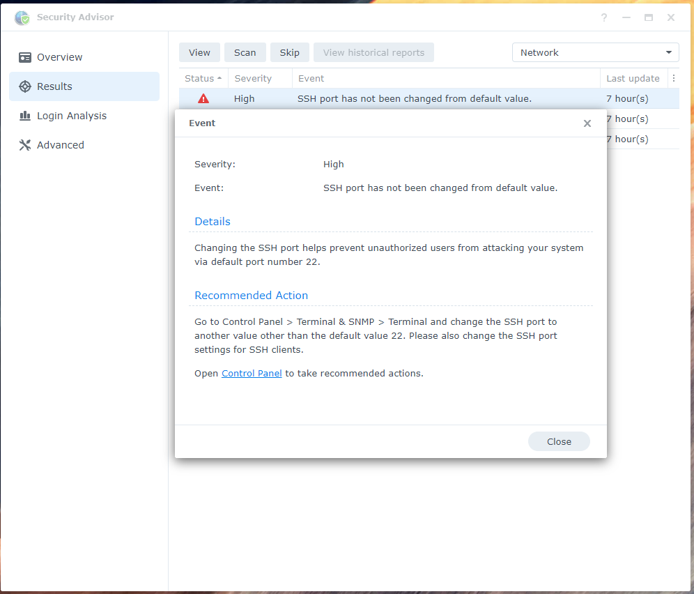

So I will be writing tech complaints here.. Here is the first one.

Turns out Synology defaults the SSH to port 22... Then if you have enabled 
the security advisor it constantly complains that is set to port 22.

Why not just set it to a random (but free) port?

If you have to manually configure SSH to turn it on then you would be aware 
that it's not running on a "standard" port. This also fails to acknowledge that
the port could be changed in synologys UPnP tool.

As much as I like Synology as it reduces the amount of work I have to do 
maintaining a family NAS I do feel that the software could do ... better. In this
case be aware of it's own Security Advisor and have "safe" defaults as a result, 
as well as have a couple of configurations in mind. The software seems to allow 
for the situation where you use the Synology NAS as a router directly configured 
to the internet, but as well as where it's behind another router. But the software
seems to pick a particular profile on a per setting basis.

I don't have any other recommendations which I have time to write here. I will post
more issues before coming up with a more wholistic recommendation than just to:
1. Use random ports
2. Have a "find random free port" button 
