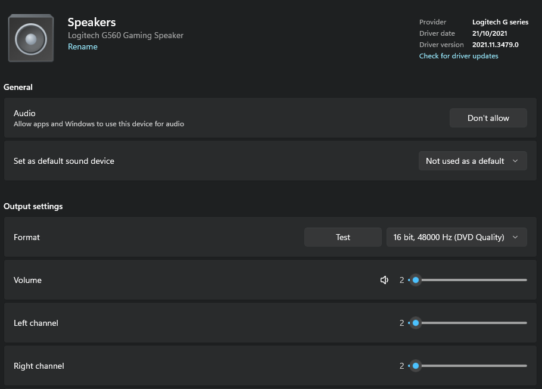
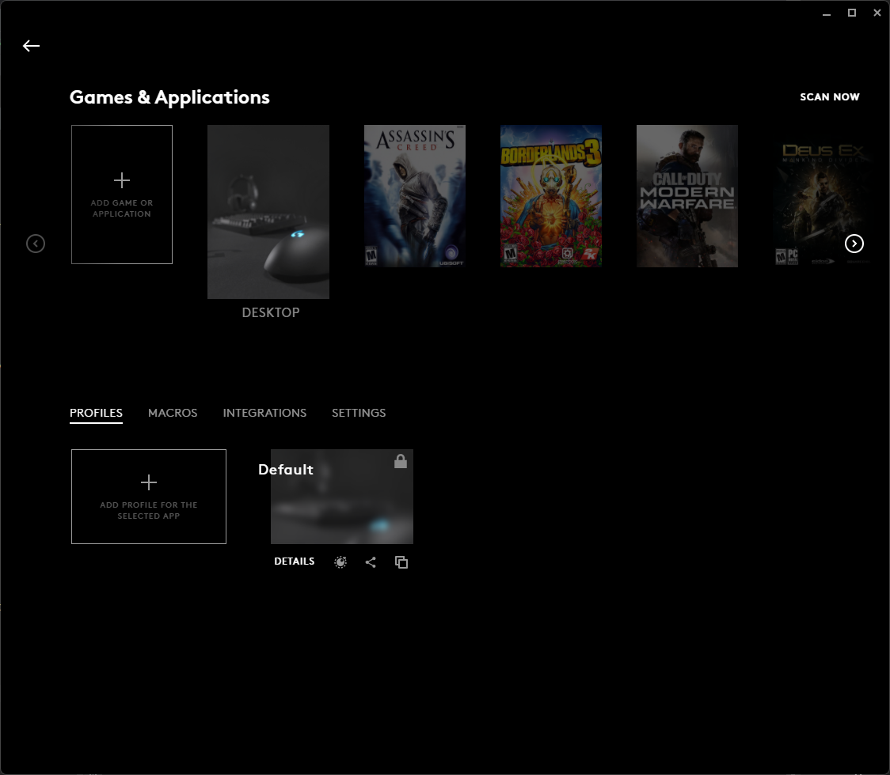
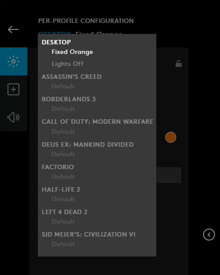
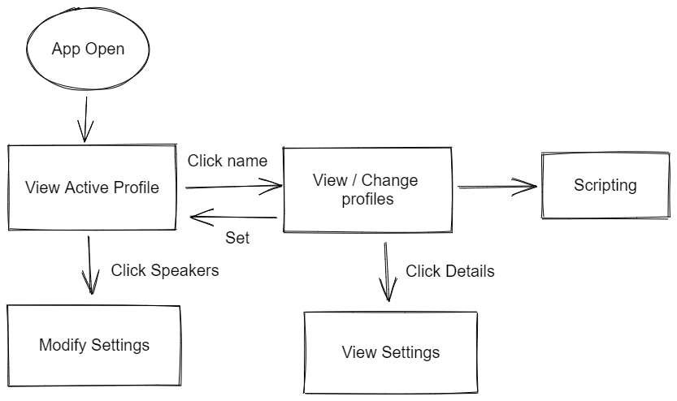

So I bought a new speaker... A [Logitech G560](https://www.logitechg.com/en-au/products/gaming-audio/g560-rgb-gaming-speakers.980-001303.html)..
I had been eyeing this speaker for a while. I assure you it wasn't because
of the sound changing aspect. But there wasn't really a lot to my reasons to pick it.

One of the major points to me picking this is, in the absence of a good list of alternatives, brand loyalty. But other 
than that. I would have to say; Multiple input (Bluetooth, 3.5", USB); Price (got it on special 30ish% and priced matched
+5%.) 

Although looking around there are some interesting alternatives, such as the: [Logi Dock](https://www.logitech.com/en-au/products/personal-workspaces/logi-dock.html)
but where would I get /that/ type of money from. (But the USB is super attractive.) It looks like it's very much web
conferencing inspired.

One thing that stands out with this is just how loud it is... I am listening to it, according to windows, at....

2% of its volume. I am pretty sure that's not exactly causing the most optimal listening experience. I will play around 
with louder volumes when I can afford larger spaces.

What always surprises me is the software. It does one thing well, and that thing is usually it's name sake; in this case
LightSync RGB. I didn't think I would like it.. But I don't mind it TBH... I haven't turned it off. However (to really
no surprise) the software doesn't consider things, such as allowing me to set different profiles depending on ... well
any other metric... Such as the time of day, for instance, I might want to synchronise it with my "[Night Light](https://support.microsoft.com/en-us/windows/set-your-display-for-night-time-in-windows-18fe903a-e0a1-8326-4c68-fd23d7aaf136)"
(Windows name for screen colour temperature.) However it does seem to offer LUA scripts I will have to play around with
however it would be nice if there were a couple out of the box. The profile component seems to be based around the 
application being used.. Almost always a game:

I have created 2 desktop profiles:

However the interface is hard to use mostly because it's hard to get a mental model around where you're in the application
quickly. The navigation looks a bit like this (omitting a lot of options:)

It's a bit weird having no way of getting from the "View Settings Summary" to "Modify Settings." It seems I have to make
the profile active to make any changes to it. With the exception of scripting changes. Having written my own share of bad
UX navigation experiences I can tell this was written for the person making the software, and very little of actual 
profiling peoples uses outside of playing games has been considered. I mean the RBG meme of just throwing lights on 
everything definitely seems to apply here. Like what "The Checkout" calls [Pink Marketing](https://www.youtube.com/watch?v=3JDmb_f3E2c) 
([also](https://www.youtube.com/watch?v=FKwYJ9eoV4Y)) but for gamers.

Anyway all for now.