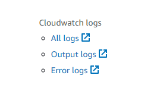

Ugh. So it turns out AWS Glue (the new interface) when you are writing a script using the editor won't take into account
the region when you click the "cloudwatch logs" link section:

I have no idea how something like this could pass. But it has. Turns out it will default to `us-east-1`. 

It seems to only occur in certain circumstances, however... Once I have selected a region post login (or account switch)
it works fine.. Perhaps this has to do with the `AWS Extend Switch Roles` plugin I'm using in chrome?
