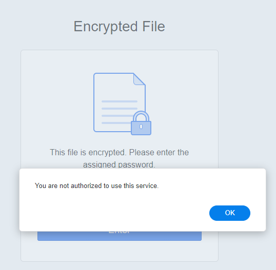
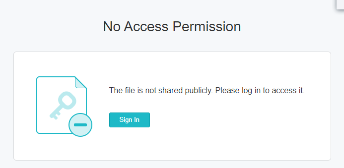
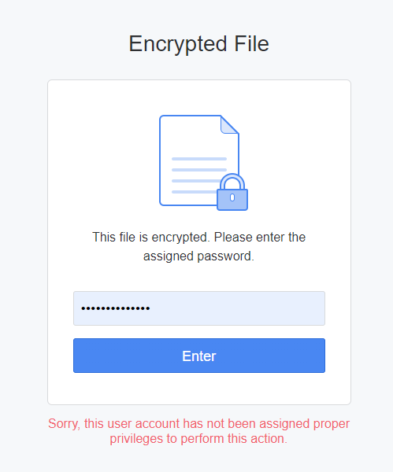
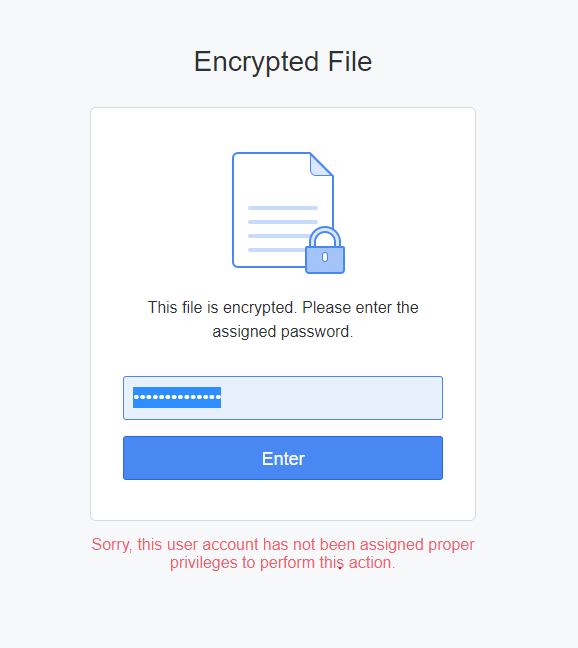

The login process and decryption/passworded document workflow with Synology Office is not great. Probably needs to be 
looked at. I was going to try figure it out and provide a nice diagram of how it works, but I don't have that much time
to dedicate to this issue.

But I get stuff like this, when my login as expired, instead of just presenting a login page, it gives me this;

Which isn't accurate. I mean this one would be more appropriate:

Which is what I get when I refresh the page and being logged out. I expect one or the other not both.

There is also a whole other set of problems such as:

Where I get that the first time I try login with the same password, then the second time works even though it was the same
encryption key. OR Sometimes if I use an invalid encryption key / password first (ie I typo), then do the correct one,
this comes up regardless what I do. -_-

# Update

The decryption page can timeout. I haven't been logged out. Just the form has timed out:

It should be refreshing something if it's past the expiry time.