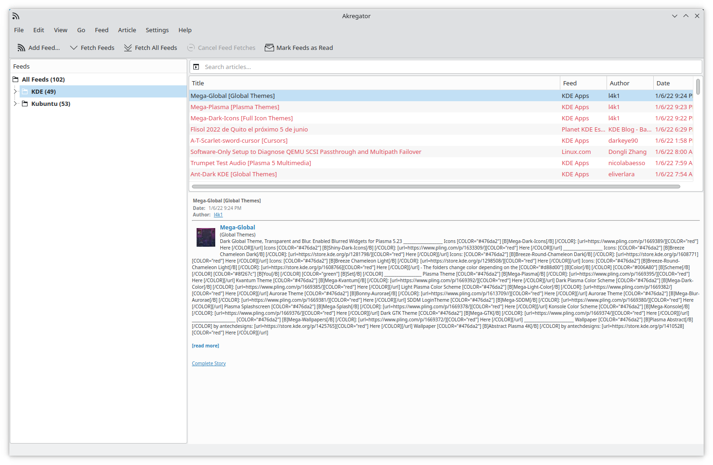

Small gripe.. But it seems that with a default install of KDE it the Akregator (RSS feed reader)
comes pre configured with the KDE blog which doesn't render correctly. -_-

Not that it matters it seems there isn't any syncing ability in Akregator meaning I will stick with
Miniflux for now.