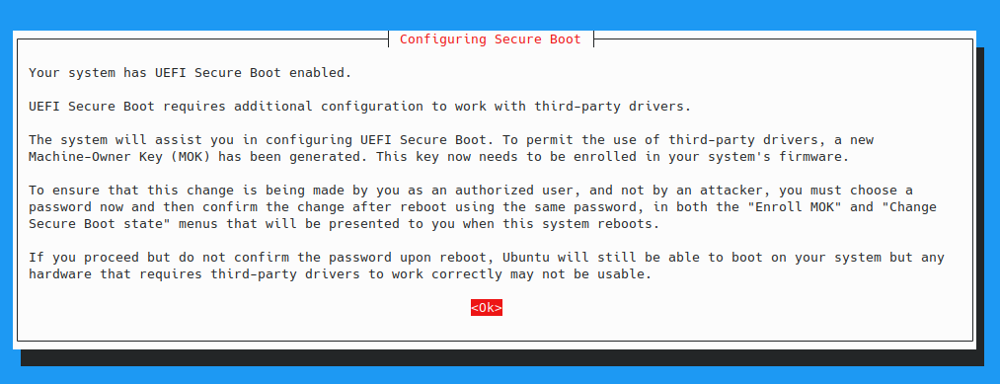

Had an issue with getting MOK to install my keys for my `Intel Corporation Wi-Fi 6 AX200 (rev 1a)` 
wireless card on my Lenovo X1 Carbon Extreme G2.. Turns out there is a bug in the shell script that
installs the self signed keys in to MOX... Which is great. But it turns out I have hit a bug..

Perhaps this is because I use zsh or somee other reason but.. Once I see:



I press enter, then it immediately exists and shows me:
```shell
# update-secureboot-policy --enroll-key                                                                  
Running in non-interactive mode, doing nothing.
```

Upon investigation it seems to be failing to "consume" the "enter" on the "ok" button.. I suspect
that the code that is used to clear the buffer before the code that ensures that we are at an 
interactive prompt isn't clearing the buffer properly. Which is causing the error: 
"Non-interactive mode" to show.

The code in question is:
```bash
            if [ -z "$key$again" ] && echo "$seen_key" | grep -q ^30; then
                echo "Running in non-interactive mode, doing nothing." >&2

                if new_dkms_module; then
                    show_dkms_list_changes
                    clear_new_dkms_list
                    exit 1
                else
                    exit 0
                fi
            fi
```

On lines: 299 in  `/usr/sbin/update-secureboot-policy`

I solved this by making the 2nd part of the condition always fail by adding a false to the end:
```bash
            if [ -z "$key$again" ] && echo "$seen_key" | grep -q ^30 && false; then
                echo "Running in non-interactive mode, doing nothing." >&2

                if new_dkms_module; then
                    show_dkms_list_changes
                    clear_new_dkms_list
                    exit 1
                else
                    exit 0
                fi
            fi
```

This worked. How ever I did notice that it didn't fully consume my enter. So when it did prompt me
for a password, it flashed up on the screen, and then told me the password was invalid because it was
too short. -- They need to clear the buffer in what ever line reader they are using.

I tried multiple other things to get here, there seems to have been another bug where the tool would
go into an infinite loop. That issue dominates google searches for the solution.

Not going to bother logging an issue it's easier to write a rushed blog post about it than follow
procedure on an issue tracker. 