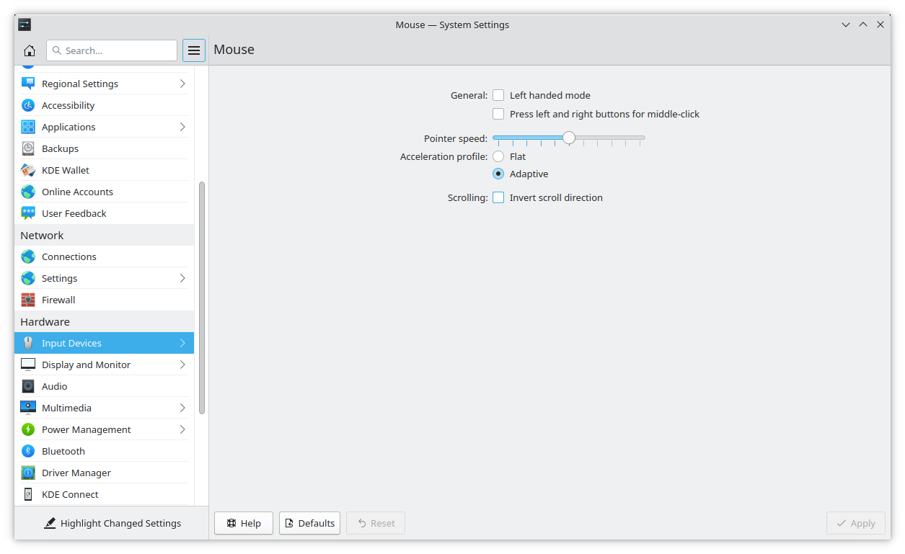
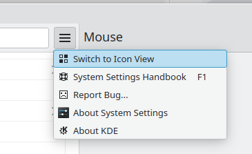
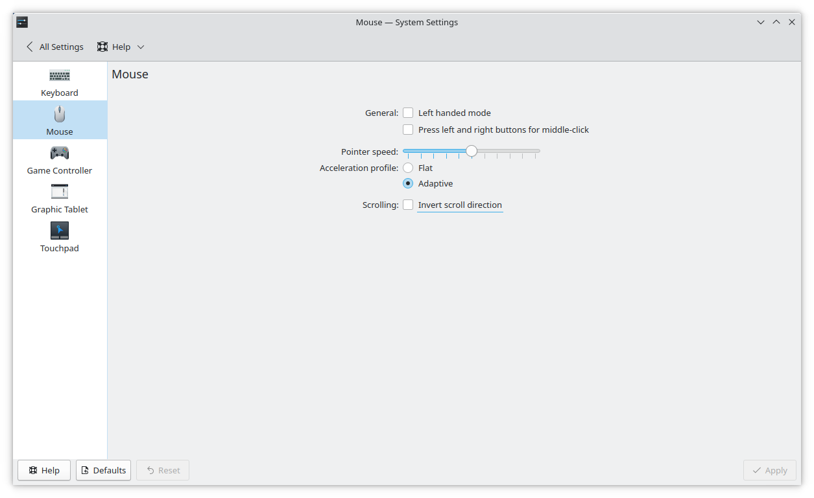

So.. Turns out the control pannel mess that exists on Windows is 
contagious. After 2 years of using Windows (because of driver issues)
I have finally been able to switch back to Linux.. However I got used
to a couple settings. One was a faster mouse scroll speed... So I go
to configure that and this is what I see:

A quick google got me here:
https://forum.kde.org/viewtopic.php?t=160416

Ugh no difference

