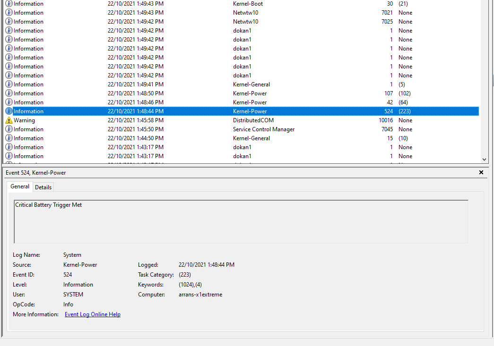

So started using linux.. Getting this issue here:

```dmesg
[  499.624767] thinkpad_acpi: unhandled HKEY event 0x6031
[  499.624771] thinkpad_acpi: please report the conditions when this event happened to ibm-acpi-devel@lists.sourceforge.net
[  517.509897] thinkpad_acpi: unhandled HKEY event 0x6031
[  517.509905] thinkpad_acpi: please report the conditions when this event happened to ibm-acpi-devel@lists.sourceforge.net
```

I really don't want to have to mail a mailing list and learn how to engage
with the community, how to write a post, and worst yet, having to subscribe
to a mailing list to get a single response.

I don't mind disclosing details etc, just having to go through a complex
engagement process is not ideal and does take a lot of energy... I will
probably be sending my machine back to Lenovo to look at due to this
issue (under windows it automatically hibernates every 2-3 weeks randomly
and event log says: critical battery issue. Let's see what Linux does.)

Windows:



```xml
<Event xmlns="http://schemas.microsoft.com/win/2004/08/events/event">
- <System>
  <Provider Name="Microsoft-Windows-Kernel-Power" Guid="{331c3b3a-2005-44c2-ac5e-77220c37d6b4}" />
  <EventID>524</EventID>
  <Version>0</Version>
  <Level>4</Level>
  <Task>223</Task>
  <Opcode>0</Opcode>
  <Keywords>0x8000000000000404</Keywords>
  <TimeCreated SystemTime="2021-10-22T02:48:44.4919877Z" />
  <EventRecordID>91201</EventRecordID>
  <Correlation />
  <Execution ProcessID="4" ThreadID="24268" />
  <Channel>System</Channel>
  <Computer>arrans-x1extreme</Computer>
  <Security UserID="S-1-5-18" />
  </System>
- <EventData>
  <Data Name="Index">0</Data>
  <Data Name="ActiveBatteryCount">1</Data>
  <Data Name="RemainingPercentage">1</Data>
  <Data Name="IsAcOnline">1</Data>
  <Data Name="BatteryActionInternalFlags">0x80</Data>
  <Data Name="IsPowerActionCallIgnored">0</Data>
  <Data Name="IsPowerPolicyEnabled">1</Data>
  <Data Name="PowerPolicyAction">3</Data>
  <Data Name="PowerPolicyBatteryLevel">5</Data>
  <Data Name="PowerPolicyEventCode">1</Data>
  <Data Name="PowerPolicyMinState">4</Data>
  </EventData>
  </Event>
```

I have gone through the support process of running diagnostic tools, 
discharging-recharging etc. I jsut don't have another computer that's 
usable while it's away for... 2-3 months. -_-

Either way:
1. issue reporting involving mailing lists / forums / complex bug trackers 
are a poor experience
2. You need to have more than one computer b/c of long tech support processes
probably not helped by supply chain / logistic issues. (Laptop goes to 
China I think.

