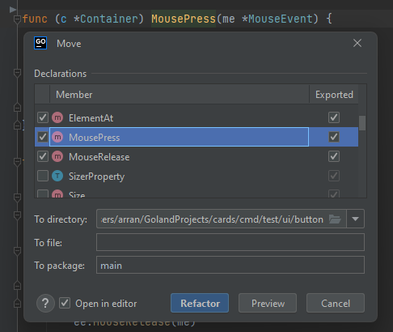

Another one from the department of should have been a
bug issue:

Why doesn't the Goland "move" dialogue show you the
receiver. When you're implementing a new interface
this can make it a bit hard to use when you start to
refactor your code.

-_-