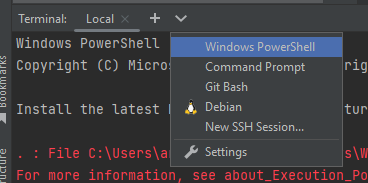
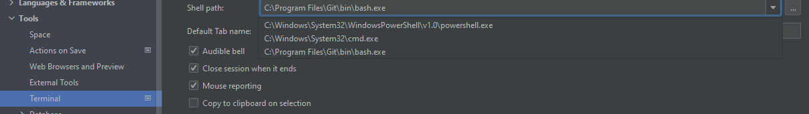
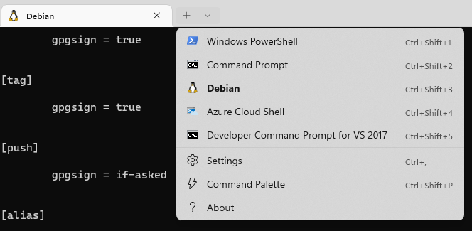

For some reason IntelliJ and Windows terminal discover available shells in different ways, but either way is
not ideal. (In-fact IntelliJ uses two different means of discovery.)

The terminal popup in Intellj seems to be unaware of Gitbash..

Which is in complete contrast to the terminal settings (same plugin) which is 
unaware of my WSL deployments. (Possibly because it's using a file path based system)
Which means I can't set Debian WSL as my default terminal in IntelliJ. However to it's
credit I can open a Git Bash instance:

Mean while, Windows Terminal Preview. Doesn't seem to offer git bash out of the box
as an option. I'm not too sure who is at fault; but I would like some consistency among
I guess "shells" provided. I presume it would default to Microsofts Windows team for some
consistency. (Also I would like the ability to add my own via .rc files like managed
via my [chezmoi](https://github.com/arran4/dotfiles) setup.)

(All of this is with the caveat: "Without additional configuration") Out of the box is
pretty important to me as I reformat / migrate often.