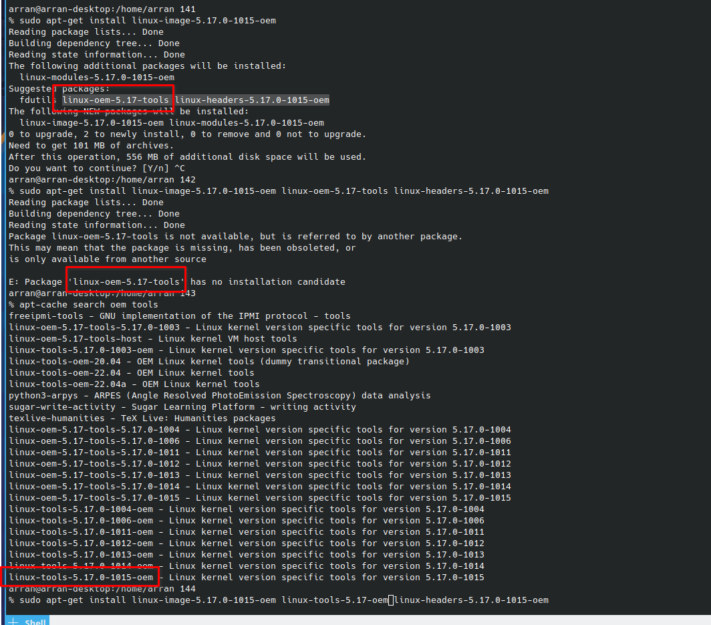

Ugh..

I would rather write here that I found this issue than log it myself.
Because from what I recall from the bug logging process
it can be pretty tedious. Especially with bugzilla. 
Perhaps Github / Gitlab has spoiled me with the ability
to log very simple bugs quickly and easily.

Maybe because web based interfaces were so hard to use
back in the 90s, it was tedious to go through bug 
reports so simply reduce them by getting as much info
upfront as possible including classification.

Perfectly understandable but hopefully we have moved on.

Anyway.. meh