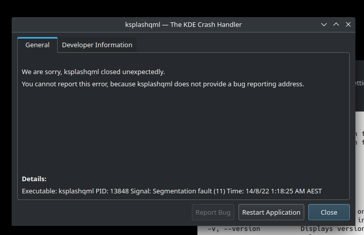

Turns out I could crash ksplashqml quite reliably rendering
my kde setup unusable simply by having a bad `XDG_DATA_DIRS`
configured in my `.zshenv` file.

I'm not sure what caused it. But it might be because it was
already set, or that it ended with a `:`

--

Edit

Actually a bit more looking around and it turns out
it is if `XDG_DATA_DIRS` contains the same entry twice 
it crashes.

