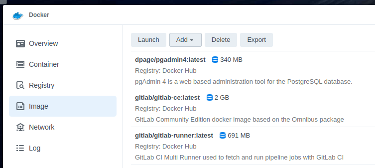
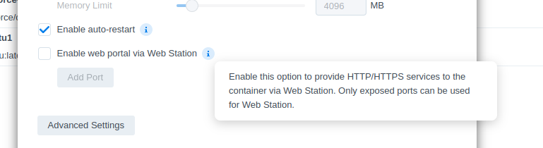

So when you use docker with Synology it has a rather
nice UI.. However it seems to be lacking things.

Such as redownloading the images for any given tag
as the SHAs don't change but the tags do! -_-

Saying that; this addition is nice:

