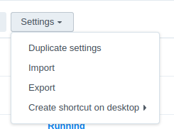
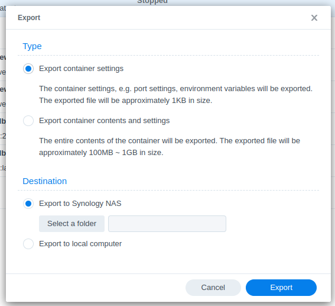
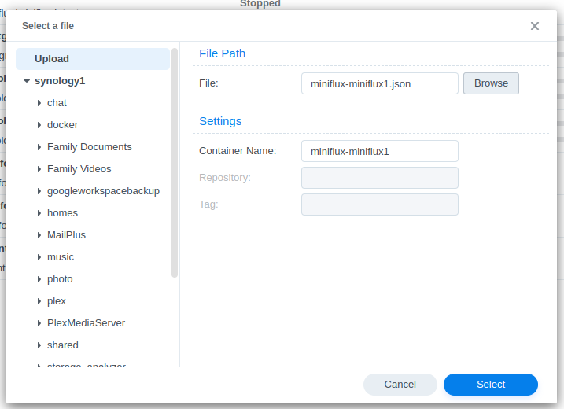
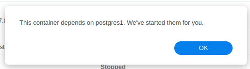

So when you use docker with Synology it has a rather
nice UI.. However it seems to be lacking things.

Such as redownloading the images for any given tag
as the SHAs don't change but the tags do! -_-

Saying that; this addition is nice:

-- 

Turns out adding itself over itself doesn't work.

And you can't add the update by a different tag name
and switch the tag on an "off" container.. So I had 
to export:

Manually modify then reupload

That worked.

Side note; this message comes up regardless of the 
containers actual status.. Rather annoying.

