Okay having used Windows and Mac OS for a couple years. Mostly due to driver issues. (Which didn't abate, 
I had to effectively buy a new computer to solve my issues. Which is rather disappointing but I think 
I will be moving back to a desktop / laptop hybrid model again. Laptops have disappointed me recently but
that's a conversation for another day.

# Title bar customization

So the move to KDE has been pretty nice in the most part. I vastly enjoy having a lot more power user 
functionality back that I lost. Such as "Window manager" native support for shading and "always above" and
"always below". Especially being able to customize it so that I can click them directly:

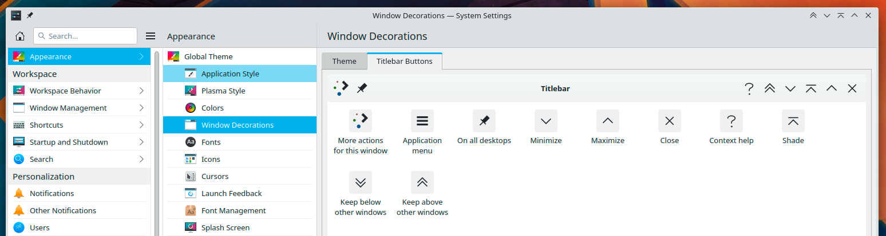

How-ever I tried the "Application Menu" option.. Turned that off, increased clicks at no added benefit.

I have enjoyed this so much I have told Chrome that I want it to only use "Native" UI borders. While I have
lost a couple of pixels it has been worth it interms of added functionality. Now I can move the desktop and
activity of a Chrome window MUCH easier. Applications shouldn't be replacing native menus in most cases IMHO
need we remind people of the "Slack crash" disaster where people couldn't close slack because slack redraws
application borders / title bar, but the JS fails when the server is down. -_-

# Shading

So pretty happy with that... Although it seems most applications can't handle been "Shaded" and instead
resize to the 0 height mode.. Something I don't recall ever happening with KDE 3 and earlier (long live TDE
https://www.trinitydesktop.org/ ) 

Shaded:

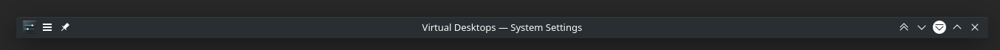

Unshade fail:

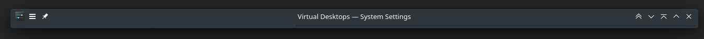

I was kind of expecting a native KDE app, like the KDE System Settings to handle being shaded. Apparently
I was wrong for expecting it.

# Activities and desktops

Something I don't quite understand are activities. I get they are supposed to provide some level of isolation
but I can't seem to set different settings per desktop. Such as I would expect to be able to control the
number of virtual desktops independently. However I can't.. They do have a redeeming factor and that is 
unlike Virtual Desktops I can set keyboard shortcuts to jump to any particular virtual desktop with ease.
Which is nice. However when I use the activities tabber it seems to want to sort by "most recent" rather 
than retain any sort of order. 

Virtual desktops have become strange.. It's clearly a grid, however when I add desktops, I have to do it
for each "Row".. It numbers the virtual desktops, however I find positional based vritual desktops far 
more handy, however I don't see any way of managing that automatically:

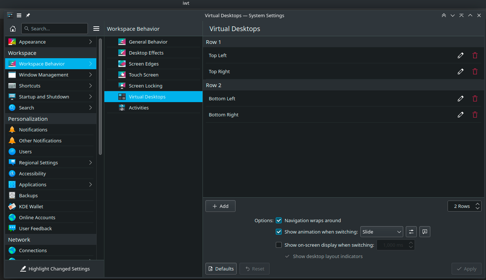

So here I am naiming my virtual desktops manually. -_- (I have since added a center row.) This seems like
way too much work.. Also my other activities I would like only one virtual desktop. Why? They are only 
for "Music" and "Games":

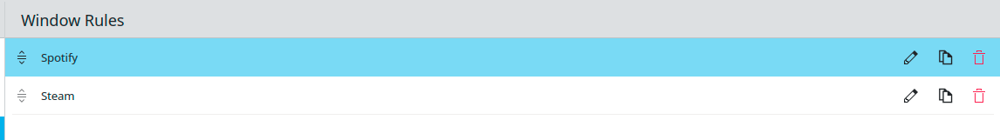

The rules are surprisingly hard to configure, especially with electron. I basically had to use the force 
setting as it seems Spotify changes it's descriptors. If only I could do it by application path but I 
gather the X api probably doesn't allow that level of inspection.

# Consistency
There is a surprisingly poor level of consistency amongst applications. I don't mind per say. However it 
would be nice to have more of the action buttons on the lists/listviews around the place. Such as in 
the settings windows view from above it has:

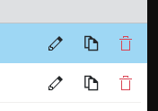

However it doesn't seem to exist in Kmail when configuring accounts where it would be a bit more useful, 
or even in KOrganizer which would help when setting multiple events:

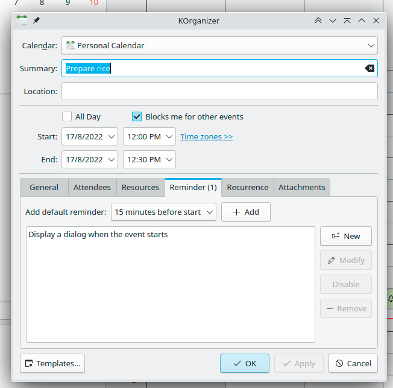

# KOrganizer

I also can't seem to figure out how to easily configure default reminders. However there are some nice
features that other applications should adopt. Such as the "quick" dates:

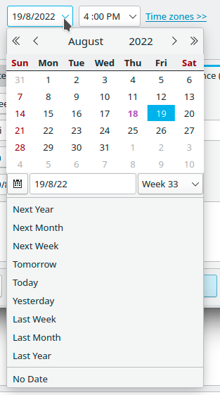

However once again, this is only limited in applications. Gmail thanks to the "Inbox" experiment has an
equivalent: 

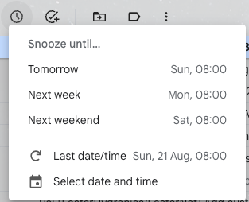

However it can only have a couple positions, and they only use it in a couple locations. Basically the same
issue as KDE. KDE however doesn't seem to apply it to times.. I would like to be able to set: 8am, 12pm, 
1pm, 5pm and 10pm as "standard" times I would want to set something to be due.

I really do like the "Reminder" Daemon pop-ups.. They don't steal focus, but are visible, don't make a noise,
and allow you to address multiple issues at once, with clear actions, such as snooze or dismiss:

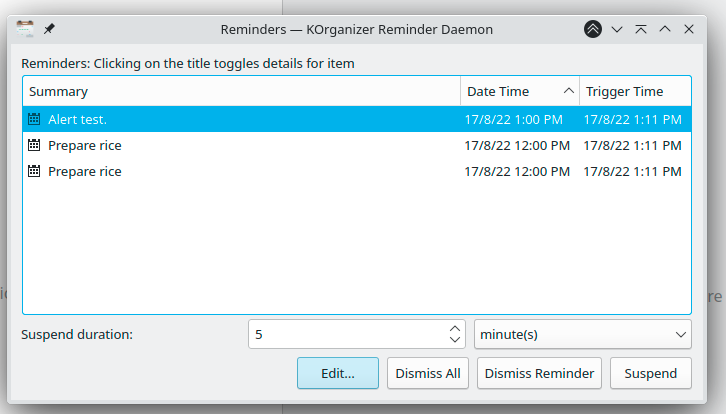

Much better than this shit:

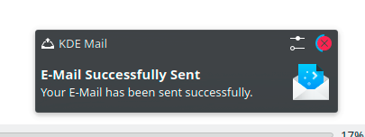

Which has become the default for messaging. I don't know why I need to get a message /every/ single time
someone presses enter on a message. Also unless I want a preview previews aren't helping me too much..

I do like the countdown in the dismiss component though:

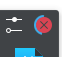

That's a nice touch.

Although for some reason the KOrganizer reminder daemon was disabled at the start, and set not to auto
start...

This is counter to my expectations. I had to look for it... It's amazing I didn't have to use google to
figure out what was going on with this. I was eventually able to find it by expanding the notification 
section and from there I was able to turn it on.

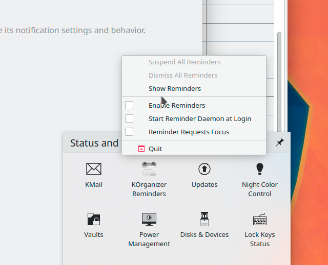

# Kmail 

I really like the fact that Kmail just shows me that there is mail in the "system tray" without having
a popup...

Although I probably turned notifications off:

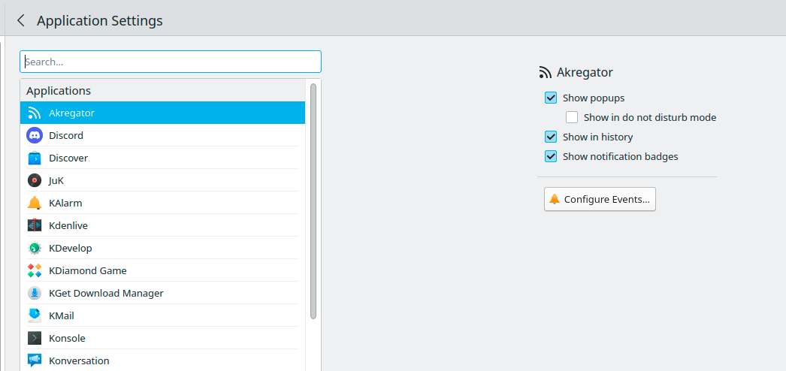

So perhaps I'm giving it too much credit..

However Kmail seems to have MASSIVE problems with large folders in Gmail, such as "All mail". It takes ages
to sync a folder and often seems to crash or get stuck, which I have to manually cancel everything, and 
then "restart" the "account" in "account manager". I kind of wish that the Akonadi Log viewer was
emdedded in Kmail so I could check the status there. Along with designed for the app. 

Also when the system got stuck checking the imap folders for changes, it would cause EVERYTHING else to block,
so, when I deleted a calendar item, it wouldn't delete, so I did it twice, later on, I randomly got this:

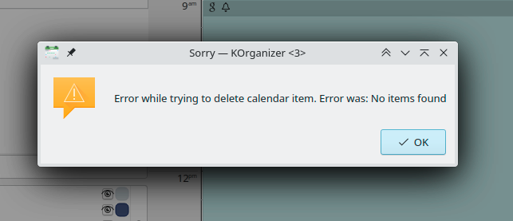

Thanks... Imap is designed to allow concurrent requests. My guess is that the KDE Imap client is rather
primitive. I would love to work on fixing that, if I could get paid for doing so... Know someone that is 
happy to pay me for doing that let me know please!

But I get very used to seeing this:

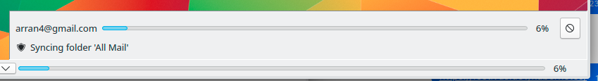

My solution around it is to go offline then go online when I want to do anything. However Kmail clearly
isn't built for Gmail as it tries to move my "deleted" items to the local trash folder rather than by 
default into an appropriate location in the IMAP server. Which for Gmail is actually "All Mail" as Kmail
doesn't seem to support the idea of an "archive" for all mail, instead it supports the tried and true,
archive to reduce the folder size. Which I guess there isn't much wrong with that as it's just a difference
in opinion. 

However the fact that it can block me from moving, and even seeing mail like this:

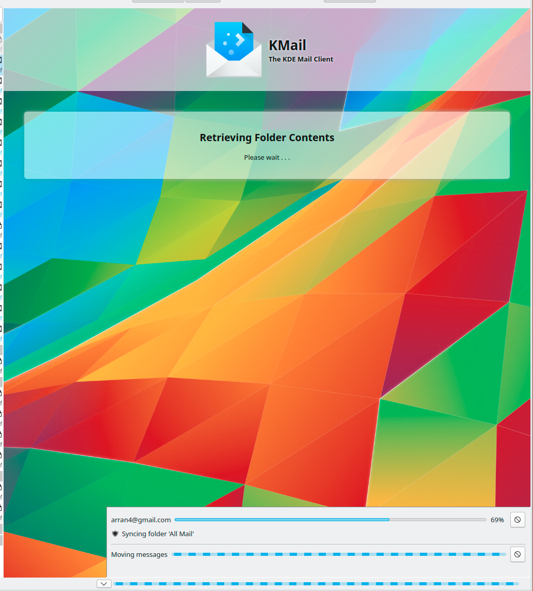

Is rather confronting. I can think of a couple solutions but without time to look at what's going on
under the hood I don't know what the realities are of the situation.

But I really do like the sort by date view it presents:

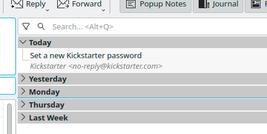

It also for the number of items (over half a million in some of my folders) renders it VERY quickly. If
I could get the imap stuff going I could move to Kmail for email, and remain on gmail on my mobile until
the day KDE has a "Mobile Klient."

# Account Configuration

There seems to be 2 places to configure accounts one being in the specific applications, such as Kopete 
and Kmail, and then one at the "KDE" level in system settings. (No screenshots sorry.) I find this really 
confusing as I don't know the scope of access or what it does, and I can't seem to give it access in part.

I have setup one of my gmail accounts there, which I think provides it to kopete.. I'm not sure. However
it's so badly misconfigured it's unusable, as I get this dialogue:

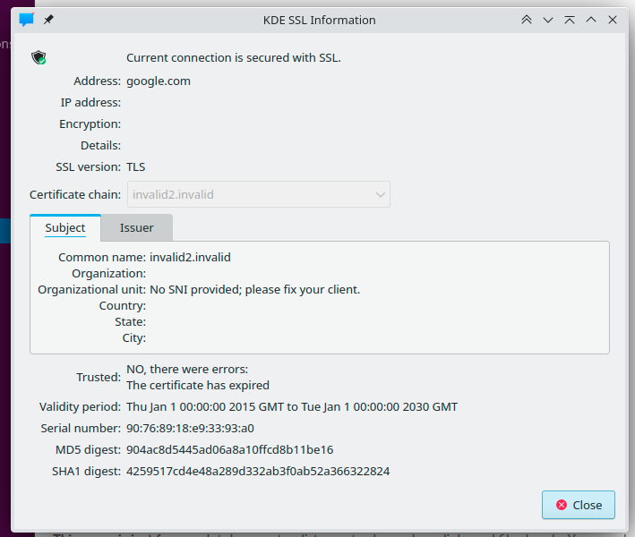

I'm sorry.. I am not going to accept that. I don't know what's going on but I don't like it.

# Notifications, again

Once again I must speak about notifications. I love all the settings:

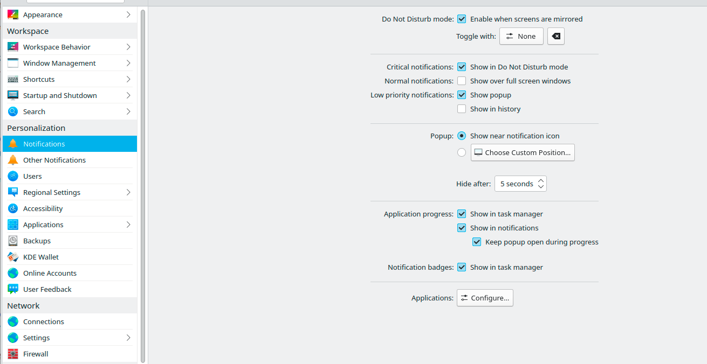

However sometimes I can be a bit hard to find things like this:

It's buried under the option:

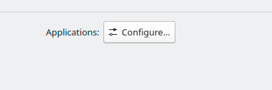

I would expect more prominence on that. 

I have setup KDE connect, however I can't seem to customize the notifications I get from it. Even though
the option seems to exist: 

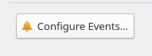

I think because it isn't fully deterministic as to what messages I get it won't help me.. However with
something as over bearing as Akonadi I would expect it to cache distinct notifications, or to at least
give me regexp filters or something..

# Settings, again

In my dot files, I have a `.face.icon`  https://github.com/arran4/dotfiles/blob/main/dot_face.icon file 
configured. SDDM seems to handle it fine.. KDE Settings, not at all:

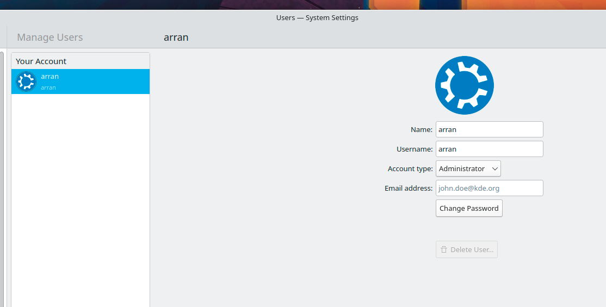

No idea why that is, but I am assuming it's some sort of standard? Perhaps XDG? (Perhaps not https://specifications.freedesktop.org/basedir-spec/basedir-spec-latest.html)
Maybe free desktop? No idea. But I'm surprised that isn't supported.

Although Kmail supports gravatar, so maybe that's where they are going with it?

Backup options seems to only support USB:

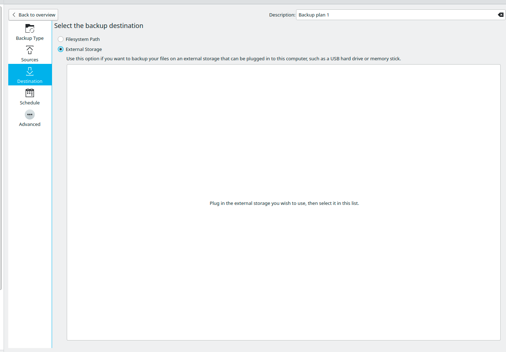

However I have a Synology NAS, so SFTP, SMB, or anything would be nice. 

I do like the configuration options. And also the integration with KDE looks:

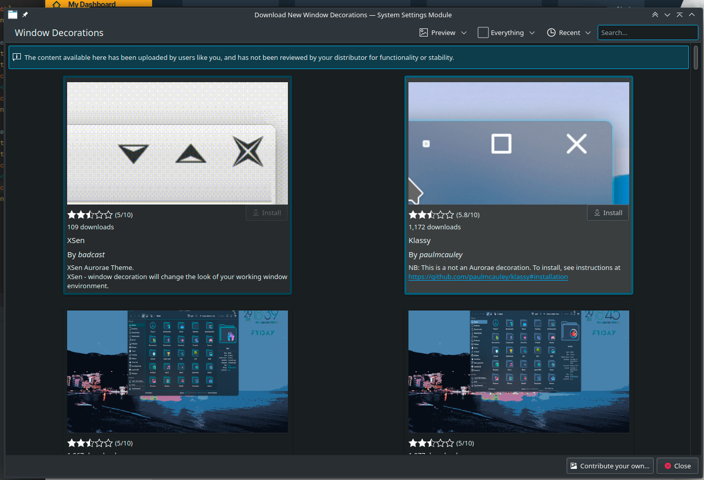

Even though it can be prohibitively blocking to explore:

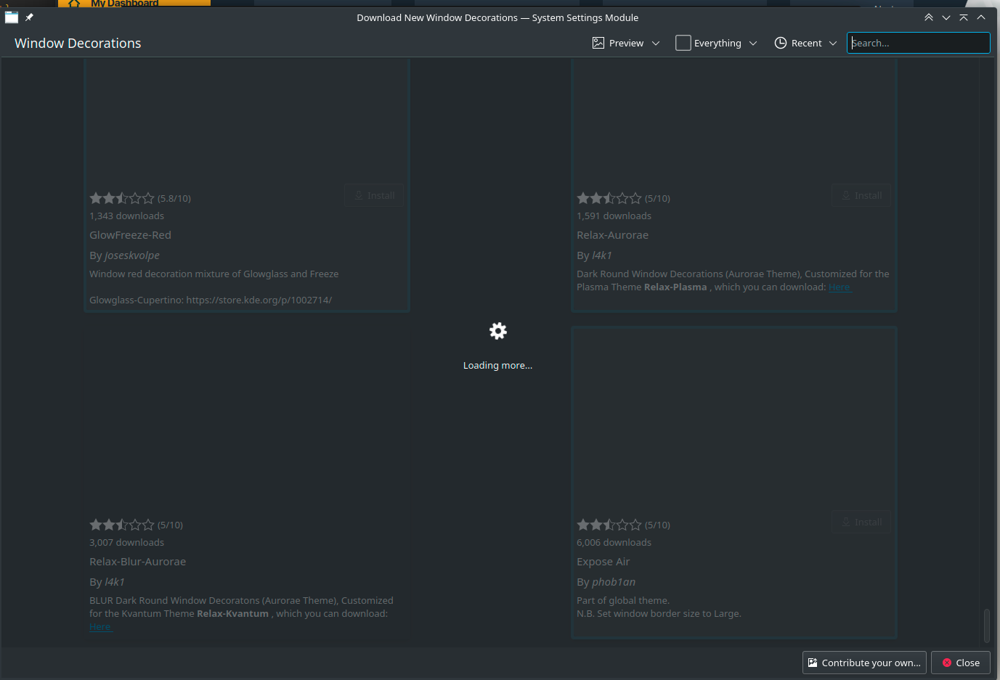

Prefetching, downloading larger chucks might be nice? But I guess they are trying to go search first...
I am not sure how useful that is to me as I am searching for a look.... Not like I can just specify the 
keywords for a look because some of the descriptions leave much to be desired:

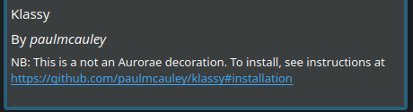

But even if it was, it's not like it would make it more discoverable:
https://aesthetics.fandom.com/wiki/Aesthetics_Wiki

Perhaps a "show 10 random" button might help? IDK.

# Crashes

It crashes a lot.. But the good news is that I don't feel helpless. I do get to log it:

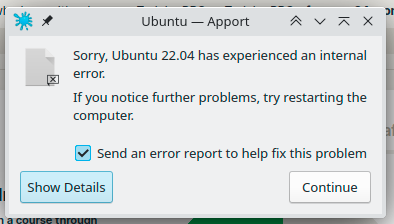

And people do respond to tickets although I was not that helpful. I will have to work on that.

# Conclusion

I am enjoying KDE. Although it seems that I have a lot to say on the matter, these are just issues. I
would love to be paid to work on it. But given that it's FOSS I don't think that is going to happen.

I did miss using KDE as my main desktop, which I don't think I have done since 2016ish.. And I don't think
I have seriously used KDE's Kontact suite since 2008ish, when I moved off Gentoo, moved house and other 
things. It seems that the imap issues remain, and it crashes a bit more but I have hope those can be 
resolved.

My goals was really to write down some of my issues somewhere so they don't have to sit in my head. Sadly
I don't think that a lot of what I wrote at the level I wrote it is appropriate for a bug tracker or any
thing anywhere interesting. But I write mostly for myself. Sorry if you take the wrong view, or if I 
discourage you. I don't mean to. Using KDE again has been a positive and there is a lot that is right 
with it. I just needed to write what bothers me. I will continue to do so for my own benefit if not others.
