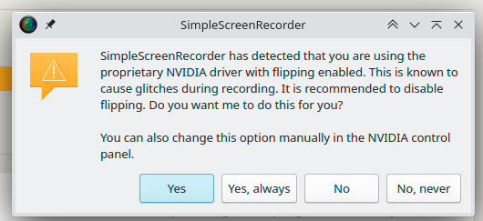
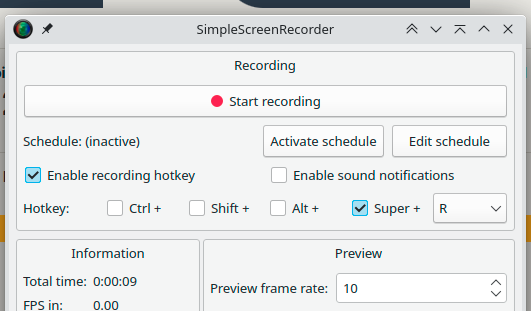

SimpleScreenRecorder, the best simple screen recorder on linux that I know of.. I think it might be a wrapper
around some shell commands. IDK.. But it would be nice if it were ported to other systems. Until then I use
OBS which is overkill for most of what I do.. (Also in Windows Screen2Gif isn't bad either.)

Got it working on a system with nVidia and got this error:

I don't know what this means, what it does, or how to undo it.. So of course I pick no, and I don't google
it.. I can only assume that the system is configured in the best way and that this is removing a feature.

Even to make it only applicable while running this. I don't know if this making a config change, or 
modifying the live state of the X server, or nvidia card.

---

Also this is just confusing:

I know "Recording" is the header, but when I see it I don't know if it's recording or not. It jumps out at
me being at the top I guess.
