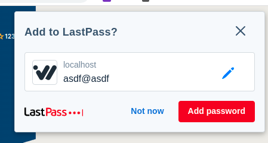
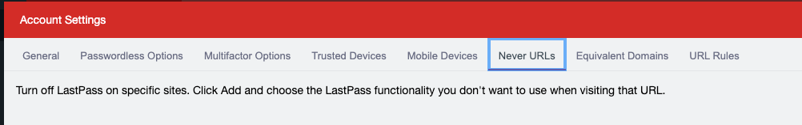
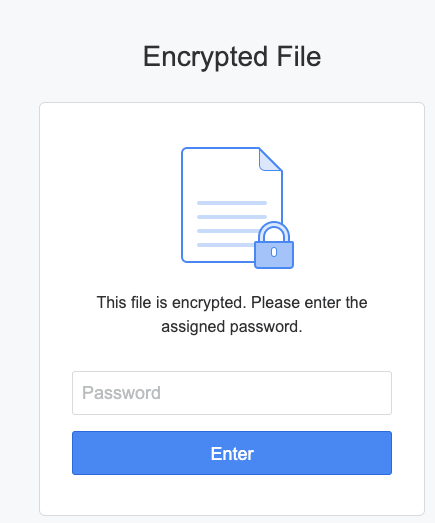

I use a fair number of password managers for various reasons. However something that bugs me with their 
prompts is they don't have a button that easily allows me to configure an exemption.. I almost never want
to remember a password used on "localhost" on some weird port number because I develop software and test
it frequently:

But yet it prompts me every time. There is a way I can manually configure this, `Never Urls`:

But they don't seem to have any sane defaults, can be hard to configure, and worst yet, don't sync to my
other computers in anyway or form. So I have to remember and populate them each time. 

However I haven't seen many great solutions from other tools, so I don't know what can be done. However 
being able to say: "never for this site" or "never for this path" or something would be nice.

Such as in Synology Drive you can encrypt files. For some reason Chrome Saved Passwords and LastPass
specifically seem to confuse this for the main login. Setting my password incorrect, or showing me excessive
or incorrect password suggestions. I have been able to configure my way around this but it doesn't stop it
being an issue.

