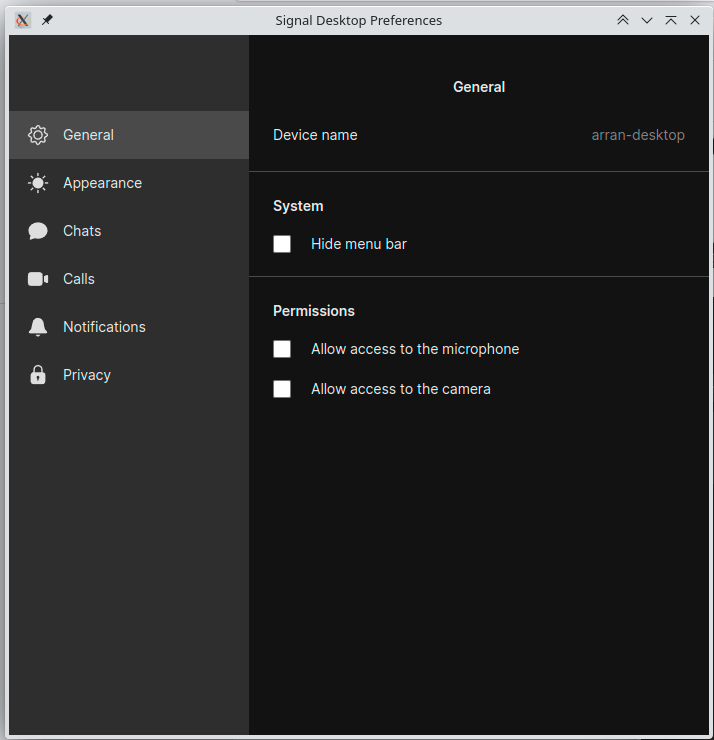

Almost all the other chat clients I have can run in the background showing only a system tray icon...

Why can't Signal?

* Slack
* Discord
* WhatsDesk (WhatsApp)

I think:
* Facebook Messenger -- Or it just harasses me.

I guess if they did so I would hope that it at least has some marker to show that conversation has 
happened.