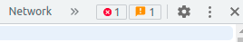
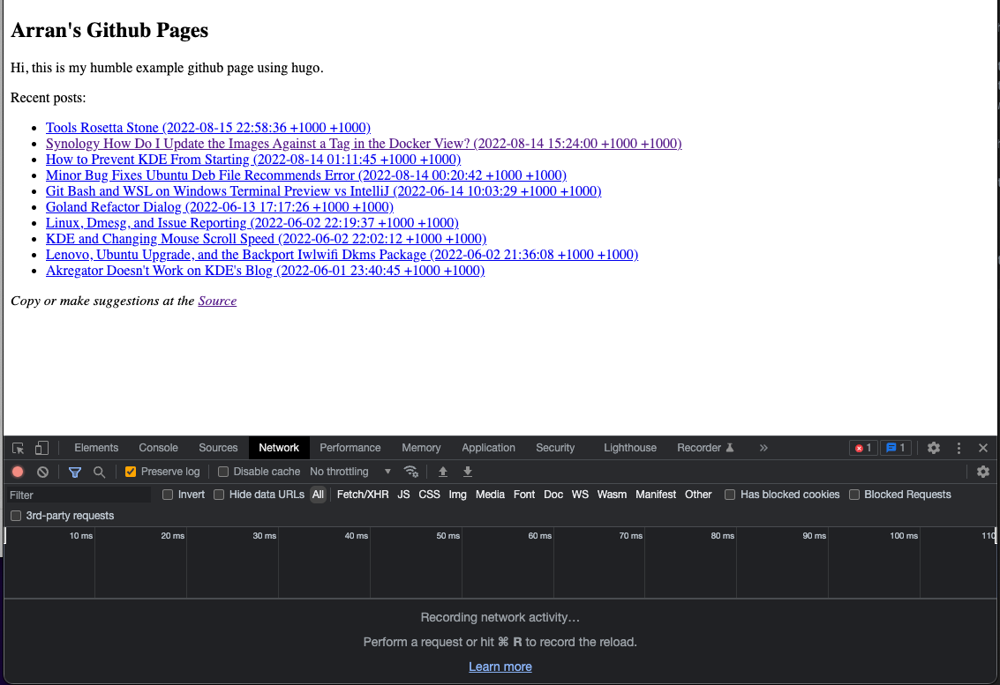
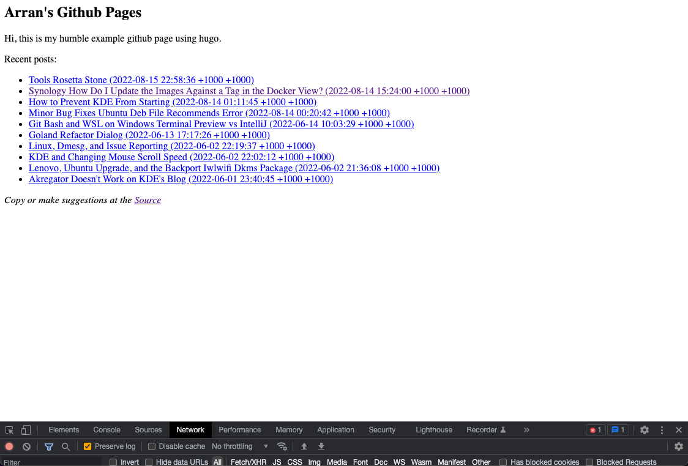
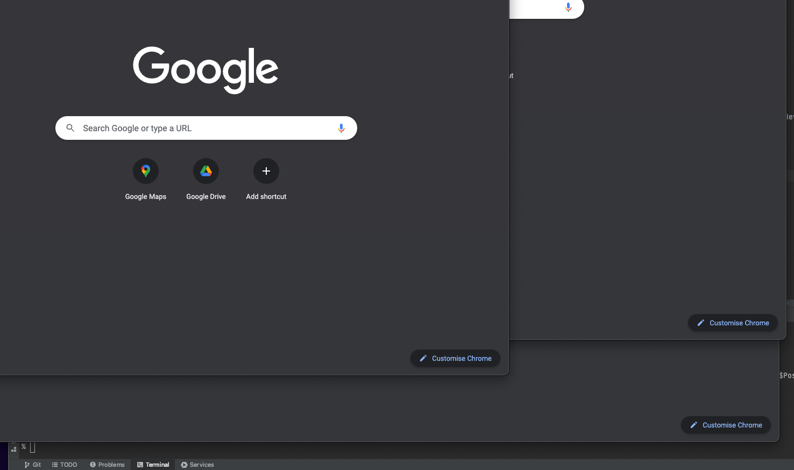

While I don't miss people using API to change the status bar text, something I can vaguely recall and I don't
think it's that useful as people don't look there that often. (Perhaps it was for help text.)

I do seem to miss the status bar, as a concept and in browsers specifically. While it was mostly use for
things such as the zoom level and SSL level, those things have been migrated to the address bar. -- I guess
that is kind of okay as monitors have gotten wider -- 

I would still like the status bar to be something 
devs can enable, so that they can see a count of the number of errors, or have an easy way to bring up the
console other than the numerous keyboard shortcuts.. 

I guess you can sort of get it by turning on the dev tools:

And shrinking it down:

But it's kind of not the same as it hasn't been designed to be there and you can't quickly toggle the dev 
options back to the same size it was pre render.. I guess a bit like "Shading" in X windows.

It also helped to distinguish where a window ended. Although I can't produce the same example I can on 
Windows and Linux, when I use mac as it has heavy shadows;

Maybe the designers of the Chrome UI a predominate Mac users? They certainly haven't considered Linux's 
additional options, such as shading.