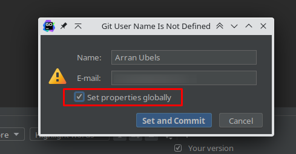

Since I have setup a [Dotfiles repo](https://github.com/arran4/dotfiles) using the useful [Chezmoi](https://www.chezmoi.io/) I am 
using a single configuration everywhere. Something else I also do is use one account for all my work regardless of the
computer I'm on.

However that means you encounter issues with software which wasn't exactly designed for users who operate under different
"aliases" on the same account. Such as, when I'm working for one of my clients, I do all my commits under the email address
associated with that organisation. While this is strictly unnecessary as people rarely use that email address, it's 
something I do. 

Interestingly enough `git` itself isn't the issue here. While Git only has space for 1 email in it's `~/.gitconfig` file
it's configuration files are flexible enough to allow you to work around the issue in multiple ways, such as [https://stackoverflow.com/questions/34597186/use-a-different-user-email-and-user-name-for-git-config-based-upon-remote-clone] having
different "project folders" for different repos using: `[includeIf "gitdir:~/work/"]`; [https://collectiveidea.com/blog/archives/2016/04/04/multiple-personalities-in-git] using a relative path for the email
by use of: `git config --global --set include.path ../.gitemail`; or the method I'm using and just leaving it unset in my `~/.gitconfig` file ( https://github.com/arran4/dotfiles/blob/main/dot_gitconfig.tmpl#L3 ) 
then setting it in each repo's `$WD/.git/config` file using `git config --set user.email arran@client.com`.

However Jetbrains products on the other hand assumes that `~/.gitconfig` doesn't have `user.email` populated as a mistake and is
insistent on getting me to set it:

The dialogue is good, but the fact that it checks it by default is annoying.. I have logged a ticket in the past for this
but I couldn't find it; I was able to find this one though: https://youtrack.jetbrains.com/issue/IDEA-283221/Uncheck-Set-properties-globally-when-set-the-project-git-user-name-by-default
I suggested that they use https://git-scm.com/docs/git-config#Documentation/git-config.txt-useruseConfigOnly as one of the
ways of testing for this behaviour. While it probably isn't the best way.

Maybe I should see if I could get some override using https://git-scm.com/docs/git-config#Documentation/git-config.txt-httplturlgt however
I suspect that that would also require a ticket for the feature to be added in Jetbrains products still.