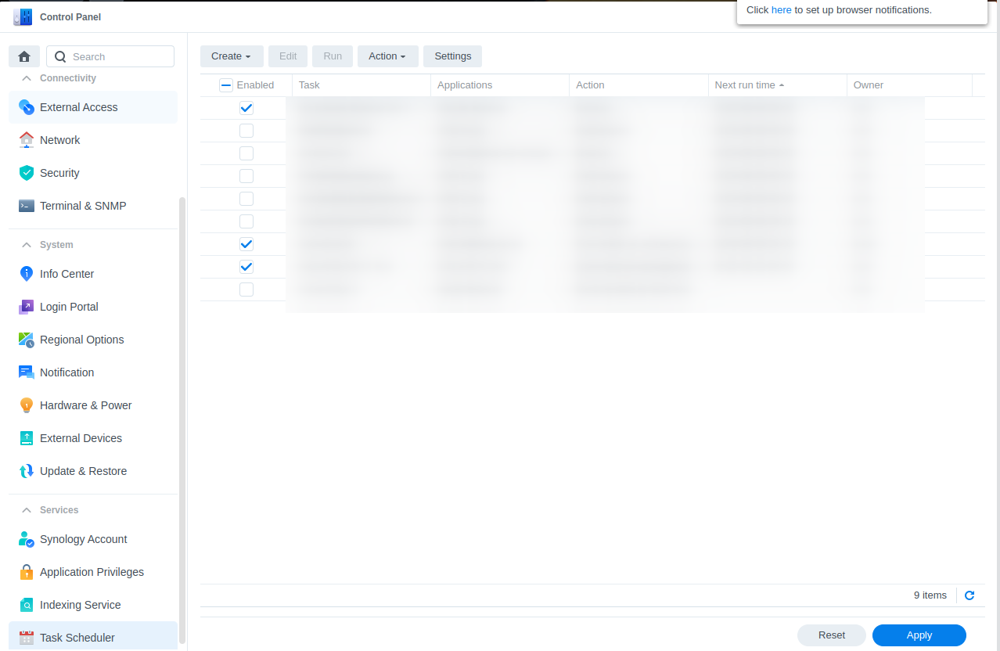
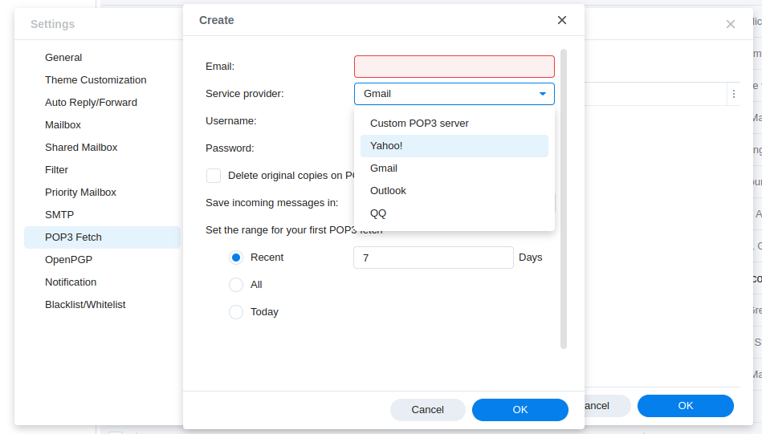
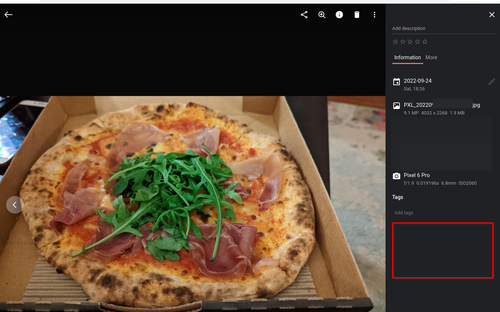
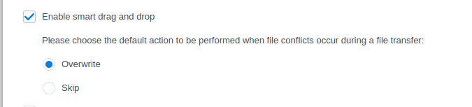
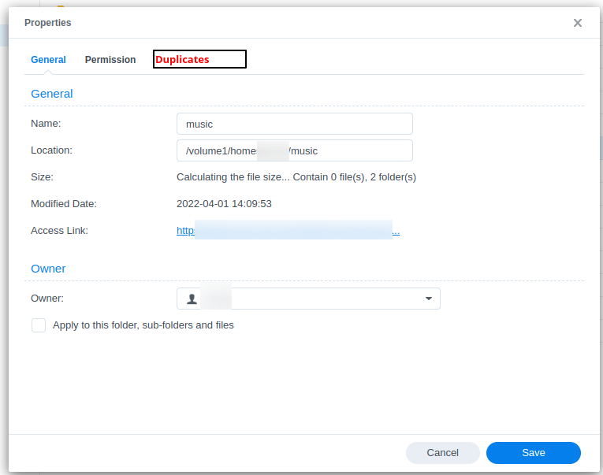
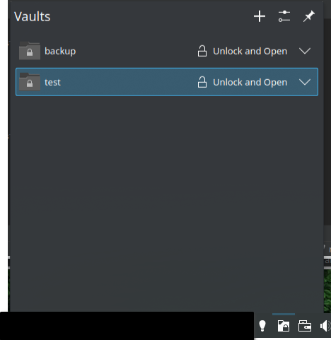

I am rather fond of synologies offering however it does leave me with a couple of whishes / desires.

# Synology itself

Sometimes I don't quite know if a feature is supposed to be for business or personal / private use. They often seem to 
have both in mind but under serve both a bit.  

Anyway here are some of my opinions:

## Software issues

I kind of want an easier way of logging software issues. The process treats it very much like you're trying to log a 
warranty issue. Especially that they treat each case as though it were an individual warranty request. It should really
be connected to some sort of statistical tool so they can figure out what they need to work on next.

Some requests will obviously still be defects they need to fix. But I think a lower cost way of logging issues in a way
it can be grouped with others. 

## More OSS or at least a more open ecosystem

While I don't need them to open up everything. I do wish there was a way of contributing to some of the components, or
at least produce my own software/plugins that add to the existing experience.

## API

I would like some form of API, or scripting language. I will add a couple specific ones under specific products. But an
api doesn't have to be nearly as complete as Google's API but something is better than nothing.

## Security 

I don't like having an account that has admin permissions all the time. For instance if I were to login to synology so
I could use the https://www.synology.com/en-au/dsm/feature/audio_station in my webbrowser from work and leave the window
open and the computer unlocked, any one can come and practically do anything under my account. There are several ways of
resolving this, from custom apps / pages that prevent this, perhaps using Oauth for the initial login, so that they can't
simply navigate to my main app.

Delegate users would be nice too. Or 2FA only being required for access that can change something.

Either way I don't feel like my data is safe provided I'm logged into my account on a machine someone could access. While
that is always true to an extent. I would like more guards not just open access.

Another thing could be at least protecting other users by creating a "sudo" like "admin" mode that requires additional 
authentication. Or my favourite at the moment would be "delegate user" ie; virtual users which act as sub users of my own
account that have limited access to my accounts resources. Ie; if my account name was: `arran` I could crete an `arran:music` 
which would only have Audio Station access. Or an account called `arran:install-files` which only has access to the Files
webpage and a particular folder `~/shared/Install-Files` for instance which I could give the username/password to to people
who don't have general access to the NAS.

Personal access tokens like what github has is also another way of creating "sub accounts"

There is a lot of space here for growth here. Obviously some are more idiosyncratic than others. But I definitely think
sub access and escalation to admin are important considerations.

## Memory / Disks

I am using the "wrong" memory module, however I would like Synology to provide some degree of certification or ability to
use off the shelf memory given theirs are expensive. I think they should be focusing on services, such as backup, rather
than trying to figure out ways of getting you to pay more for hardware. Semi-relevant side note; Expontent.fm seems to talk
a lot about Apple being unable to make the move to services either probably for the same reasons.

## Deduplication

Deduplication (Duplication identification more accurately) seems to be an admin thing only. Normal users should get a copy
of this report or it visible in the "Files" tool, or a way to invoke it.

## Scheduled tasks

Regarding the scheduled tasks feature: 

### Normal users sandbox and access

Schedule tasks are nice. However at the moment they are only available as an admin feature. However I do want the ability
to run a script at set times as a user on the system. Such as currently I have such a script to move files between Dropbox,
Onedrive, and my Synology Photos directory. While an API would help solve this, or better yet an internal scripting tool
the ability to run applications sandboxed under the user as some things use an API.

The there are a lot of ways this could be implemented, probably some of the safer ones is a custom scripting language, or
using managed user docker containers.

## Settings and control panel

Some things are a bit harder to find than I would expect or hidden in menus. While I do like what they are attempting to 
I find something such as the: "Applications" (Nginx configuration files) Under the "Login Portal" should really have it's 
Own item in the list view rather than be bundled in "Login portal" while I guess technically they probably had to create
"nginx router" as part of creating their web "login portal"

## Synology MailPlus

I like the simple mail client. It has comes with all the basics you need. While I intend to use it via imap with KDE's Kmail
it does seem to have some issues. I would like to use it more but I need some things addressed.

### Filters / Scriptability

I would like more scriptability here. The filters are simple kind of filters. So much so I don't really bother using them.

I would like the ability to edit the filters as though they were text, maybe with some import/export utility. (I haven't looked
at how they work, maybe they are just imap sieve scripts? I can't easily see right now.) 

Scriptability is actually a separate concern but these two issues could be addressed at once. (I have complex filtering
and sorting requirements, to the point that certain emails should create folders.)

### External accounts

What I really want to use my MailPro plus for is not exactly receiving mail but syncing my mail from other sources into
one area, which is why I want the scriptability / filtering rules so I can decide which email goes where. (I have 6 domains
mapped in too, which I want to put emails in separate folders that act as inboxes) However this part of Synology MailPlus
seems to have been forgotten. It calls the feature "Pop3 fetch" which I'm actually after mail syncing, or fetching from
multiple different sources. I guess syncing is a bit too much. 

Once again depending on how scriptability is handled. It might be possible for me to write my own mail fetching / mail syncing
solutions and bypass this. However the Pop3 fetch section is out of date. It should be "Mail fetching" in general and it 
needs to support API based services such as Gmail. Gmail now uses an Oauth2 like system for authorization: https://developers.google.com/identity/protocols/oauth2
which needs to be considered here.

### Mail import / Export

I have a bunch of mail archives on my NAS would be nice if there was an easy way of importing them. But I'm happy with just
using IMAP to do that.

## Synology Drive

I use drive a lot. There is a lot I like about. It has started to replace my use of Google Drive for a number of reasons.

### Scriptability / API

This comes up again. I used Google Apps scripts a LOT, while I did expect to abandon some of them. I have completely lost
functionality as a result of this not being implemented. Even a primitive version would work. (Provided I can make scheduled 
tasks.)

I would also like the ability to access content from applications. Perhaps with Personal Access tokens, although I hope
with those tokens you can apply a decent ACL to folders or some such. This would come in useful when using tools like: KeePassXC
and KeePassAndroid, which supports onedrive, dropbox, and google drive but not Synology as it doesn't have an API.

I used to use dropbox but they limited the free account to just 3 devices: https://help.dropbox.com/account-access/computer-limit 
quite some time ago and I have sinced moved on to other password managers. However it would be nice to go back. I'm not willing
to pay for way more dropbox than I need just to use it to sync a password manaager, but I would happily improve my NAS instead.

### Google Drive Takeouts / Import / Export / Sync

I would like a way to selectively move files (and if possible whom they are shared with) to my NAS some sort of import / export
tool would be nice.. OR simply creating an API and then I could create my own tools to do this.

There is a google drive syncing feature however it doesn't sync the actual documents, it syncs everything but the documents.

Something I used to accidently delete a lot of my own documents when I tried to move them into Drive using the Files tool. 
This to me is a pretty serious UX issue, especially as it breaks the "Reversibility" expectation, I had to find other ways
of reversing that and I'm not sure I got everything.. I guess I will find out later.

### Sharing with people who are not on the NAS

Not always is sharing with a URL the best way, having some way people can SSO / OAuth2 into the device to get a list of
files they have access to by email address, without actually creating an account would be nice. Or something along those
lines.

### Encrypting and Decrypting en-mass

I moved a whole bunch of simple text files to the NAS I have over 2000 of them. I would like to encrypt them I have no way
of easily doing so. As a result I have not.

I would also like the ability to encrypt an entire folder, so that when I provide my key, it's for the folder and it's 
entire contents that session and I don't have to do it multiple times. Perhaps even allow my key to be my phsycial security
key?

## Synology Photos

I am slowly moving to synology photos, I have a couple big issues with it though.

### Not all pictures are photos

I have a lot of pictures, not all of them are photos, and not all of them I want to see in my "Timeline" view, some are
photos but I don't want to see them in my timeline view. Being able to mark (root?) folders explicitly as "exclude or include
in timeline view" would be very useful in this system. Even having the default view set at a per folder level would be nice.

In the past I created / downloaded a lot of pictures which aren't photos or personal but I don't want to get rid of them 
and sometimes I want to view them in their own timeline but I definitely do not want to see them in my main photo timeline.
(I roughly use the timeline view of my phones 4-5 times a week so I am not a lite user.)

This would also help pave the way for "Private photos" and "Receipts"

### Google Photos Takeouts / Import / Export / Sync 

Just like google drive a way of migrating files between the two would be great. Especially with comments and shares.

This also applies a bit with sharing photos. People like to use their own photo tool. Being able to share with those people
would be quite valuable / viable. Having the software run on a NAS and not be subject to Synology vendor lockin means that it isn't
against the business interests to allow their platform to upload photos to various cloud solutions and share on it. Which
means Synology Photos wouldn't just become a place I store my personal photos but a system that I can use to orchestrate my
digital photo impact. Although I'm not sure how much the "competing" platforms would appreciate aggregation in such a way.  
Least the ability to use the takeouts to report on it would be handy. Least that way I can figure out which photos I can
delete.

### Sharing with people who are not on the NAS

(Basically Identical to Drive.)

Not always is sharing with a URL the best way, having some way people can SSO / OAuth2 into the device to get a list of
photos they have access to by email address, without actually creating an account would be nice. Or something along those
lines.

Obviously email notifications or some other system would be nice.

Or even where it uploads the photo to the appropriate photo tool (icloud, google photos, facebook albums etc,) and then 
uses that platform to share it with the user.

Also being able to send photos in full, scaled down or as links in email from Synology Photos would be quite nice.

### De-duplication

Synology seems to handle file deduplication as an admin thing (it sends out a report), while I can understand the necessity 
of that. I think it's seriously lacking in it's ability to let users deduplicate their own content. I have multiple copies
of my photos as I restored it from various backups and other tools. If Synology Photos could simply provide a list of files
with the same contents that would help.

Given it's a photo platform being able to group similar photos would also help me a lot. Perhaps something in the side
menu here:

## Synology Files

I like the file manager but it has some issues.

### Replace / Skip

There seems to be a massive issue with moving files around, the two options it gives me are:

I figure that this was supposed to be feature that people don't use too much. There are other things to consider with this:
* What if the files have the same / different content
* What if the files have difference case (capital / lower case) but the same content?
* What if I want the files renamed
* What if I want to see a preview or a complete list of options
* What if my preference changes per folder
* What if I want to undo a replacement that was made by mistake
* What if I want to review on a case by case basis?  
  * What if I want to preview when I do that?
  * What if I want it to do what it can safely do then ask me at the end about all the others?
* What if I want to undo the whole thing, or the half completed thing?
* What if I want a transaction log of what was replaced.

I think KDE or windows does a reasonable good job these days but neither are perfect.

This one is one that bugs me a surprsingly large amount.

### Duplicate reports

It would be nice if the duplicate reports, or there was a feature to detect and report duplication was built in. Such as
for both folders and individual files. Even if it were reported in the property like so:

Perhaps even a tool that will allow me to say "merge these two folders into this location". I guess a bit like BeyondCompare would?

That OR once again this could be solved with an API.

### API

I think I have covered this to death. But if the Files view had an API (while it technically does have a lot of other options
including running programs as admin/root locally, or mounting the folder as a network drive) it would be nice if it could 
do other things

### { Entry / hiding / Star / Favourite } folders

As an admin you get a view of a lot of folders. It would be nice to be able to ensure that you land at a particular folder
without having to choose alphabetical names. Such as my "chat" folder or "docker" folder, I don't want to see as often as
my "home" folder. There are a number of non-mutually exclusive solutions here.

Although the "favourite" view that Microsoft has adopted in Windows 10 / 11 has probably gone a bit too far as it's very 
unclear where your files are actually being stored. The beginning of which Synology is kind of getting with the "home" folder
which is a "virtual" view of the "homes/$user" folder.

## Individual file and folder encryption

Obviously encryption would work differently to the Drive solution. But being able to have an encrypted folder. Perhaps 
that works similar to the KDE Vaults, where it prompts you for the key on mount and you have to manually mount it:

# More to come

I have plenty more, but I have run out of time for this at the moment...

## Note station

I like what is being done here. However being able to have separate tasks lists, and perhaps exposing an API so I can sync 
it with KDE PIM tools, and / or import / sync with Google Tasks.

The syncing part of how this works is one of the better systems.

## A password manager

This one is pushing a bit but a simple password manager which supports multiple profiles, and uses a syncing system similar
to Note Station with a bunch of apps and browser extensions just like note station would be nice.

## Download manager

This is actually rather nice. A desktop tool would be nice. AND the ability to use it from the browser as an extension. It
falls over on Google Takeout downloads, which is one of the places I most want it. I guess the only way you could get it
working with that would be to copy out cookie details as part of the extension, but an extension that does that is also
high risk.

## Plex

It's nice having plex there but it gets a bit out of date. Perhaps double down on the docker side of things?

## Webstation

Is confusing and feels oddly limited. Perhaps this is connected to the whole "Login portal" issue, I spent a lot of time
when I first got the synology trying to use it to expose docker containers. I was using the wrong tool.

SSL Registrations should happen in the same location.

## Surveillance Station

I don't have too many complaints about this. Except previews on the Android device.

## Docker

The Docker app is clearly under development. However it's a bit confusing I have written some of my issues with in the past here
* https://arran4.github.io/blog/post/2022/014-synology-how-do-i-update-the-images-against-a-tag-in-the-docker-view/

More to come on docker. It's useful but there are limitations.

## Synology contacts

Once again API and integrations. If I could sync it with my google's AND my Kmails and maybe a couple others it would be
fantastically useful. Especially if it integrates with other products. So I could use it for sharing, or even auditing
what is shared and with whom. At the moment it's a rather basic solution.

## Virtual machines

My machine is way too slow to use this. But it would be cool if I could.

## USB Copy / Backups

I tried to use this it was slow. Would be nice if I had enough disk space for it to prepare the sync for when I plugin 
the device. But I like where it's going.