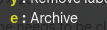

I use the keyboard shortcuts `[` and `]` a lot in gmail. 

However, when I do I establish a "direction" but sometimes, I press `e` as I want to go back to the thread list. I don't
always navigate the same direction.

For a while I turned on the "auto advance":

Option. Today I abandoned it mostly because it doesn't support the notion of "inertia" IMHO.. Basically I want a 3rd option
that is along the lines of:

4. Normally go back to thread view, but if I have used `[`,`]`,`j`,`k` previously continue the previous direction I was going.

I don't think it will happen but it would make this option far more valuable to me.