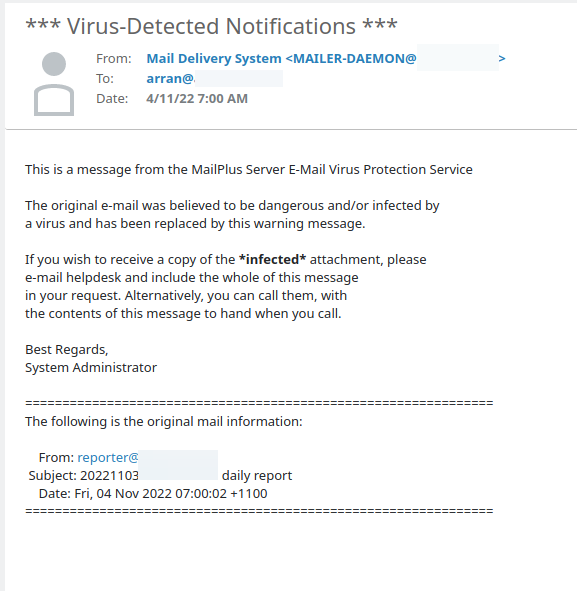

Why!? Synology Mail Pro is decent and all. It feels like a management layer on a bunch of open source mail tools. Plus 
and Android app which is quite nice. However it has a bunch of quirks which make me wonder if people actually use it inside
synology. Or at least various configurations. 

One of the odd components of the synology mail system is the mail component isn't fully "abstracted" between components. 
Which means you need to configure mail in a couple locations rather than just one. They have done a fairly good job TBH
but it isn't quite at the level it should be.. One of the quirks as a result is that (and I suspect this might be
because of my dkim and spam filter) that it catches it's own report email as not just spam.. But a virus!?

There is a high chance that this is a config error, however it should really be able to tell me or detect this to some
degree.