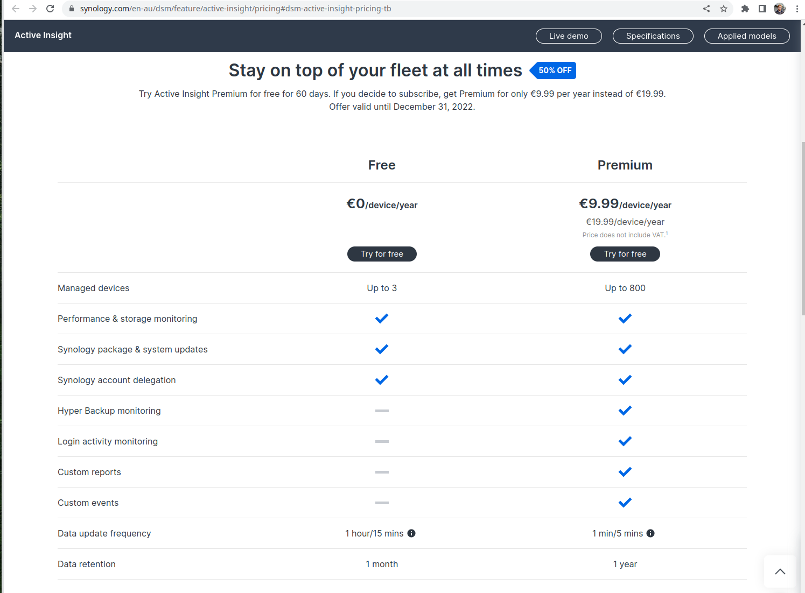

Synology Active Insight has gone pro!

Made me think about my previous comment. If they offered a more "general" service which included value added things like
email processing etc. It would definitely make it seem more worth it. 

I think they should offer domain services and some email services for free still, however they can add more services
along that lines. Such as an "email proxy" so you don't have to directly expose port 25, (and maybe 110) for instance.