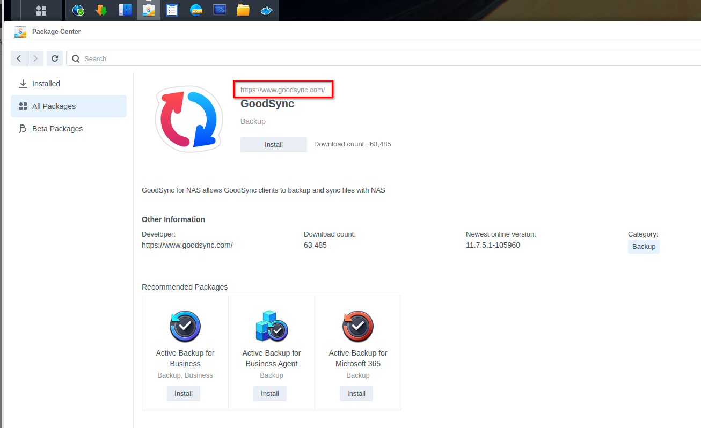
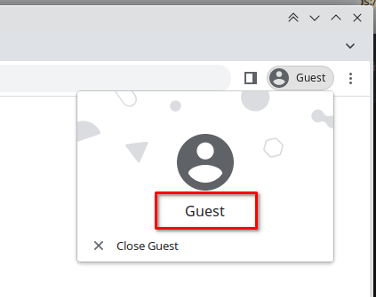
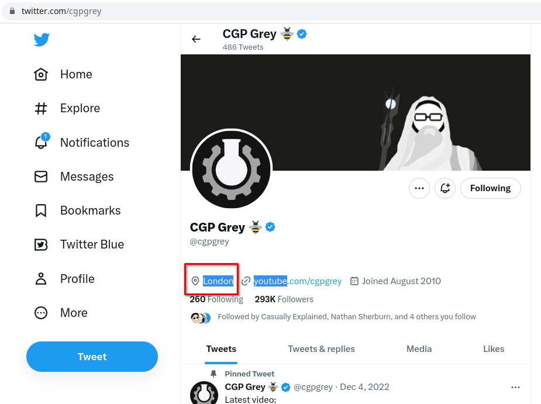
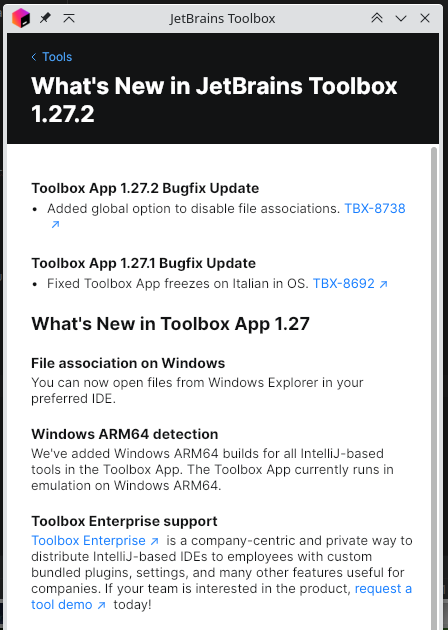
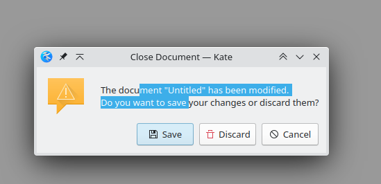

One of the major improvements over time has been how text in error messages and other "static" components have become
more like read only text box / webpage and interactive over the years. Which means when you get an error message you can
copy and paste the text to aid you in your search. This also means that links work.

A lot of web pages seem to have failed to grasp this, and have made sections of their application "unselectable", links 
"unclickable" and more annoyingly but less importantly, have failed to place white space between distinct elements which 
means when you go to select text (often by double-clicking and dragging in my case) you "over match" and select elements
that are unintended:

Synology seems to have done the same in its package manager:

None of the text is selectable, and the link is not clickable. I suspect this is done because of a perception of "read
only" being more corporate or professional or something... Maybe this comes from the old days of embedded applications
in web pages being used by corporates. Think ActiveX/OLE objects, Shockwave-Flash, and even Java Applets which acted 
completely distinctly and had very minimal integration with the rest of the browser other than placement.

Chrome does it too despite using the Qt framework which is generally pretty good at this:

Twitter in it's location is a current (which will probably change) is an example of the white space issue, double click
on the location when it's a single word and it will "spread" to other elements:

This would also happen when you're selecting in "word" mode rather than "character" mode. (Select has modes, double-clicking
enters you into word mode.)

This is something I actually do a fair amount. Not just idle-ly while on the phone but for the search shortcut.

Note having given Qt some credit I have to limit it to just it's error messages, such as you can see in Jetbrains Toolbox
App, it isn't always selectable:

And an example of a message box having selectable (and hopefully thus copyable) text:

Kate is part of KDE and thus uses Qt.