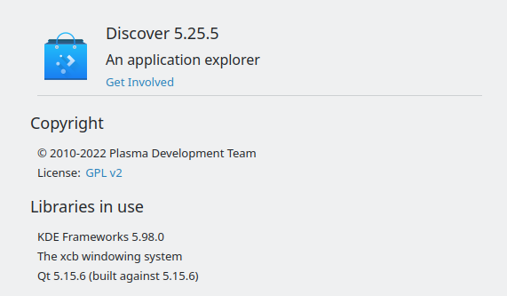
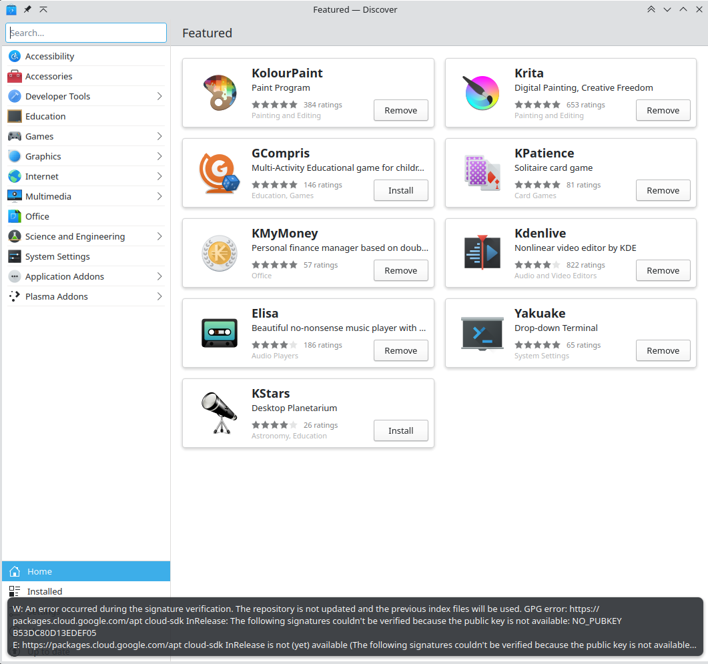

KDE's Discover...

I find this KDE application really annoying. I understand what it's trying to do. But it just feels:
1. Too slow in comparison to the CLI
2. It hides too much information
   1. Previous errors 
   2. Packages that are being updated
   3. In settings, it doesn't show the URLs or anything advanced for the repo
3. It requires too much waiting between actions, it does very little async
4. Error messages are showing as UI blocking "notification" then disappear, there doesn't seem to be a log somewhere.
5. Provides almost no options to correct common errors -- which it could collect and suggest!
6. Snap is non-optional

I just find it pretty frustrating. I wish it would be more useful and resolve the feeling based issues from above.

One mode I really want it to have is "Update on shutdown or restart" then as a result dismiss the tray icon.

Back in the 200xs I would have loved to be a paid KDE dev and even now that seems tempting but probably to many other 
people. However, I would fix things to my own ideals.