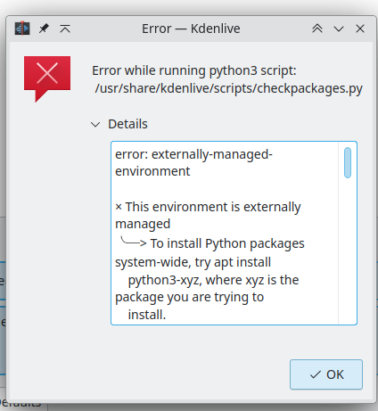
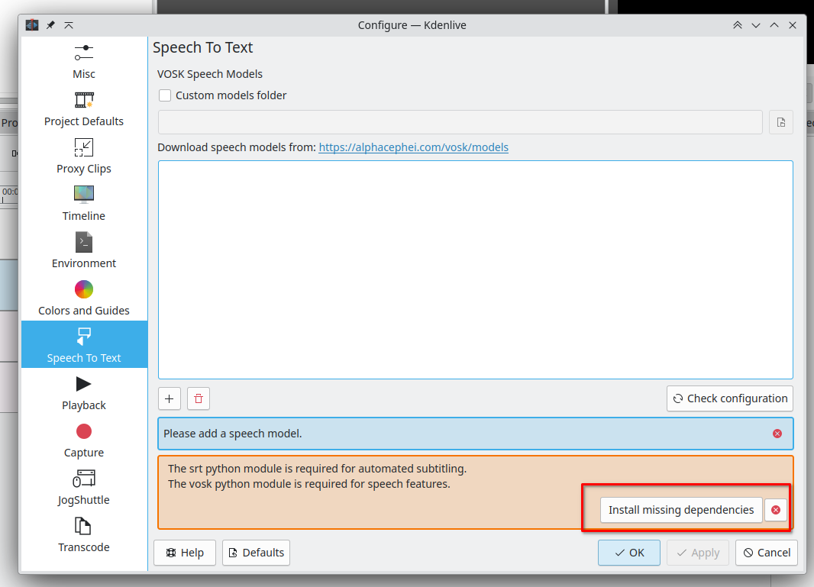

Tried to use Kdenlive to install some packages via pip (I didn't want to but that's what it offered) finally got a good
rejection!



```
error: externally-managed-environment

× This environment is externally managed
╰─> To install Python packages system-wide, try apt install
    python3-xyz, where xyz is the package you are trying to
    install.
    
    If you wish to install a non-Debian-packaged Python package,
    create a virtual environment using python3 -m venv path/to/venv.
    Then use path/to/venv/bin/python and path/to/venv/bin/pip. Make
    sure you have python3-full installed.
    
    If you wish to install a non-Debian packaged Python application,
    it may be easiest to use pipx install xyz, which will manage a
    virtual environment for you. Make sure you have pipx installed.
    
    See /usr/share/doc/python3.11/README.venv for more information.

note: If you believe this is a mistake, please contact your Python installation or OS distribution provider. You can override this, at the risk of breaking your Python installation or OS, by passing --break-system-packages.
hint: See PEP 668 for the detailed specification.
Traceback (most recent call last):
  File "/usr/share/kdenlive/scripts/checkpackages.py", line 50, in <module>
    subprocess.check_call([python, '-m', 'pip', 'install', *missing], stdout=subprocess.DEVNULL)
  File "/usr/lib/python3.11/subprocess.py", line 413, in check_call
    raise CalledProcessError(retcode, cmd)
subprocess.CalledProcessError: Command '['/usr/bin/python3', '-m', 'pip', 'install', 'vosk', 'srt']' returned non-zero exit status 1.

```

Some decent attempts at maintaining good system integrity. If only enough systems do it, so that that the community
adapts properly to doing things the right way.



The guilty party.
