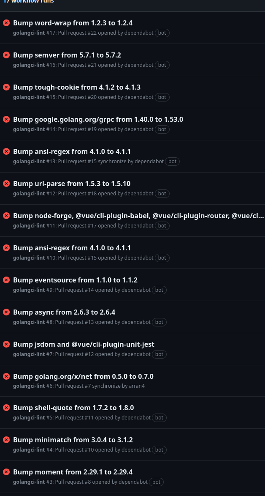

A while back I added `golangci-lint` to the github actions of all my projects. I never got around to insuring that they
all have compliance, which means a lot of my projects look like this:



Which is fine. It's about gradual improvement when I have time and I am able.

However the thing that bugs me about linters is that they have ego creep. WHere it moves away from being about reducing
the chance of errors happening, into a world of insuring there are the correct number of new lines between functions.

I do get the argument that you want a degree of consistency in a corporate environment. But I have a couple thoughts on lints:

1) You need to build the tool appropriate to the team and business as they are now with an eye to growth. So by default
most of those rules should be disabled until the need arises
2) Lints are supposed to catch more serious errors that can easily slip past the developers focus, not formatting. Whilst
that is how it is used a lot now we should really be using another tool for those sort of breaches, such as a "prettifer" 
or a "manualofstylechecker" or something. Even if it's the same code doing the work it should be a different executable
or step. For the same reason we have a distinction between `warning` and `error` we need a distrinction between a: 
`style error` and a `potential cve` error. It also allows the dev to defer style changes
3) Sometimes you want to breach style in order to make the code consistent, a bit like how gofmt ensures that in a `const` 
or `var` block all type, assignments are aligned into a table like structure, sometimes I have something "unnecessary" such
as: `S1039: unnecessary use of fmt.Sprintf (gosimple) Name: fmt.Sprintf("purpose query"),` which is there for the purpose
of ensuring the code is consistent. I would be hard to check that in a stylistic checker, but without accepting that this
is the case and appropriate in some cases you would have to have `lint ignore this` comments all over the place which is
another type of pollution. (Comments are for people not programs.)

One thing I do, for several reasons, is commit each lint fix as a separate commit with the lint error as the commit message.
I want to make it clear why I'm making a change, as well as make it easy to find. I am a micro committer and to me it's a
zero cost for others thing. However, it's also a way of providing feedback to the project as to regards how the linter is 
causing issues but in a way it can be referred to again at any point. Lint rules have a time cost so they should be for the
more serious ones, stylistic issues should be automated as much as possible. You're not in the business of correcting 
people's behavior just making sure what is submitted is good.

# Auto fixers

The idea that lints can auto fix the issues is a bit far-fetched for the purpose I believe linters are for. But here we are
where it enforces (often but not always) stylistic issues.

Seems golangci-lint has some. I couldn't quite figure out how create a PR for a suggestion for the linter in the 15 minutes
I assigned myself to the duty. (The code base is written for people who know the code base rather than anyone.... Another
issue to discuss later: `so good its bad dev`.) 

Anyway time for me to get to the purpose behind writing this... A dumb dump of thoughts.

## SA1019

The `error`:
```
main.go:46:2: SA1019: rand.Seed has been deprecated since Go 1.20 and an alternative has been available since Go 1.0: Programs that call Seed and then expect a specific sequence of results from the global random source (using functions such as Int) can be broken when a dependency changes how much it consumes from the global random source. To avoid such breakages, programs that need a specific result sequence should use NewRand(NewSource(seed)) to obtain a random generator that other packages cannot access. (staticcheck)
        rand.Seed(time.Now().UnixNano())
```

I tried to run it with `--fix` (Nothing got fixed at all...)

I think the auto fix should be this:
```
<+>UTF-8
===================================================================
diff --git a/main.go b/main.go
--- a/main.go	(revision 1ab5b07bf148f6c71178707d1486e67d1975bf56)
+++ b/main.go	(revision 528c6282c3167518f09bb168e1b3229e85dfb899)
@@ -43,7 +41,7 @@
 
 func main() {
 	log.SetFlags(log.Flags() | log.Lshortfile)
-	rand.Seed(time.Now().UnixNano())
+	Seed()
 
 	port := os.Getenv("PORT")
 	if port == "" {
Index: main_postgo119.go
IDEA additional info:
Subsystem: com.intellij.openapi.diff.impl.patch.CharsetEP
<+>UTF-8
===================================================================
diff --git a/main_postgo119.go b/main_postgo119.go
new file mode 100644
--- /dev/null	(revision 528c6282c3167518f09bb168e1b3229e85dfb899)
+++ b/main_postgo119.go	(revision 528c6282c3167518f09bb168e1b3229e85dfb899)
@@ -0,0 +1,7 @@
+//go:build go1.20
+// +build go1.20
+
+package main
+
+func Seed() {
+}
Index: main_prego119.go
IDEA additional info:
Subsystem: com.intellij.openapi.diff.impl.patch.CharsetEP
<+>UTF-8
===================================================================
diff --git a/main_prego119.go b/main_prego119.go
new file mode 100644
--- /dev/null	(revision 528c6282c3167518f09bb168e1b3229e85dfb899)
+++ b/main_prego119.go	(revision 528c6282c3167518f09bb168e1b3229e85dfb899)
@@ -0,0 +1,8 @@
+//go:build !go1.19
+// +build !go1.19
+
+package main
+
+func Seed() {
+	rand.Seed(time.Now().UnixNano())
+}

```

It will be deleted in most cases, but provides backwards compatibility and doesn't assume that the seed is in `init` or `main`.

## `SA6005: should use strings.EqualFold instead`

This is a pretty decent suggestion. 
```
SA6005: should use strings.EqualFold instead (staticcheck)
                        if strings.ToLower(emailTo) == strings.ToLower(currentUserEmail) {
```

Although it's the type of check which assumes that it is always right and that there are no cases in which you would ever
need to use the other comparator so when you do you end up with 100s of comments exempting it. 

I would have thought this would have worked with `--fix` it's simple enough. I mean I can review the changes before committing
to git. (I'm a micro-committer) and revert any I don't agree with. Although would be nice if: https://github.com/golangci/golangci-lint-action
had a "create PR for auto fixes" mode.

## S1025
```
 S1025: the argument is already a string, there's no need to use fmt.Sprintf (gosimple)
 ```

Should `--fix` easy.

## S1007

```
api/excel/projecttemplate.go:275:26: S1007: should use raw string (`...`) with regexp.MustCompile to avoid having to escape twice (gosimple)
                                {Column: "D", Value: regexp.MustCompile("\\r\\n").ReplaceAllString(eachDay.Day.Tasks, "\r\n"), Style: wrapTextStyle},
```

Yes, should auto fix but also, a bit petty more of a 'did you know' moment. I can imagine working with the type of person
that would reject a PR based on this.

## SA1019

```
SA1019: "io/ioutil" has been deprecated since Go 1.19: As of Go 1.16, the same functionality is now provided by package io or package os, and those implementations should be preferred in new code. See the specific function documentation for details. (staticcheck)
        "io/ioutil"
        ^
```

This one is a good one I guess. But it has backwards compatibility issues. I don't think the solution I did with `rand.Seed`
above is a good one in this case as it ends up duplicating a lot of code, but I have a hard time seeing a backwards compatible
solution for this.

All of these should have at least had an attempt to provide a `--fix` solution.

## SA4010

```
 SA4010: this result of append is never used, except maybe in other appends (staticcheck)
```

I like this one.

## SA1019

```
SA1019: datastore.NewQuery(model.TimesheetsProjectKind).Filter is deprecated: Use the FilterField method instead, which supports the same set of operations (and more). (staticcheck)
```

Wasn't expecting a datastore specific lint... It should probably be a bit more verbose about this? I wonder how they manage
their rules. What is in and out of scope for this tool? -- Ah, it seems (without looking at the code) it looks for a 
`Deprecated:` tag in the function comment defs. Ignore what I just said.

## S1019

```
S1019: should use make([]*datastore.Key, len(body.Files)) instead (gosimple)
        filesDS := make([]*datastore.Key, len(body.Files), len(body.Files))
```

Ugh, this one is more of a go issue. I feel that you should be explicit about each parameter here so that people don't 
have to memorize the behavior of the function, as it is exceptional. Everything about `make()` is irregular. The use of
varargs is probably to blame here, it should really have been just a normal function. That would have reduced cognitive
overhead. I remember this being used as part of the interview at a particular company, I guess it does test familiarity,
however I tend to avoid things like this. It does seem to go against the ethos of the language too.

Another solution to this instead of making them fixed args, is to allow for optional args, or allow for function "overloading."
However I feel that the lint should be insisting on more parameters not fewer for explicitness’s sake. This is probably a 
good example of personal preference being injected into the lint. It creates an eminence based culture with how the language
is to be used. Although the go design started there it shouldn't be extended to the community as a bunch of rules people
follow without proper reasoning or thought.

# Non lint issues:

## JWS deprecation

```
 "golang.org/x/oauth2/jws" is deprecated: this package is not intended for public use and might be removed in the future. It exists for internal use only. Please switch to another JWS package or copy this package into your own source tree. 
 ```

Kind of connected to the `internal/` debate. However in this case, they should have suggested an api compatible alternative
or something. However given it's the first result for me when I google `jws golang` I think they should add it as part
of the scope of this library, or move it to `exp` or something. It kind of needs to be promoted.