Lately I have been a bit obsessed with a communications protocol: Matrix. While I haven't done too much with it directly.
I did attempt to read the spec etc. However, it seems a bit ... large for what it is. I have been using a couple Matrix
clients and a couple matrix servers/services. Namely, [Beeper](https://www.beeper.com/) is the primary one.

I do enjoy Beeper, and support what Beeper is attempting to accomplish. What it is, is in effect a paid, closed source 
Matrix client and an open sourced managed service. That aggregates a bunch of other services:

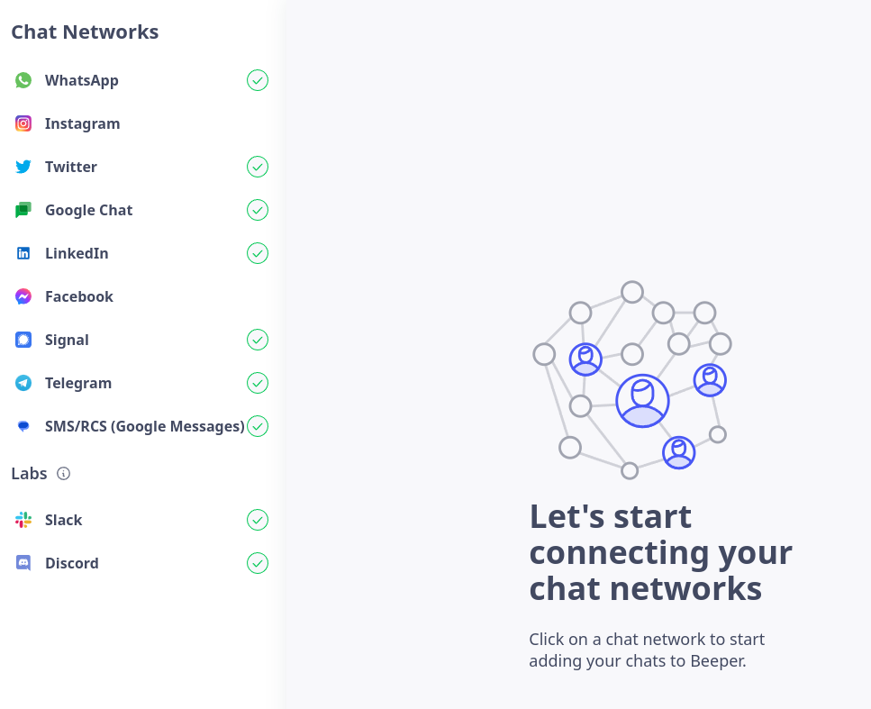

I guess the first 2 notes relate to that modal.

Please note I predominately use Beeper on the desktop. 

# Bug: Modal and ESC

Pressing escape does not dismiss the modal, it closed the chat you have open underneath. -- To be honest, a modal is 
probably not needed here, and it could be embedded inside a "chat pane control."

Modals in the app are a bit strange, when most apps tend to be making their windows just "tabs." 

# Gripe: Meta / Bridges

I am not using Facebook, or Instagram on it, due to regional issues. I would if I could run the bridge locally, so all
the traffic comes from my IP. As far as I can tell it's not possible to opt to run your own bridges at all.

Being able to run your own bridges closes the gap on a lot of issues people have with others running the Matrix server, 
depending on how secrets are managed when you do so. So far the only bridge (probably in part rather than in full) to 
run remotely seems to be the RCS / SMS bridges for Android, of course I'm not sure if they are running on my phone in
full. But TBH my phone is more likely to be running these days than any of my servers 24/7 in the long run.

# Gripe: Download notifications

They are using a toast / in app notification for downloads. This is annoying. Getting feedback that a download has or is
happening is super important. However, this is really only useful in the case of a large download where you need to be
notified:

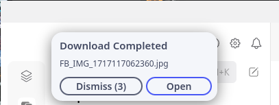

I think some form of combination of these would be nice:
1. A dedicated "chat" window, with the history of all your downloads - in "Low Priority" - Infact logs are super important,
a general notification history / security audit log would be really nice.
2. When you opt to download something, an additional status icon on the message where you downloaded it from appears
3. Larger downloads / more async, have system notifications rather than in-app
4. In app existing notifications do have a purpose, I don't know what for

# Gripe: Personal bridges & AI

I would like to run my own bridges, I am not entirely sure how they connect to the server, it might be a risk to do this.
However, I would like to connect my own bridges for my own purposes, such as AI via https://github.com/gotzmann/llama.go,
or even just silly things like a calculator. 

While AI is hype and a bad right now, I still think it's very relevant and Beeper should at least try to provide the chat 
mechanism. There is probably a lot of scope for it in the future, given how things are going. 

Personal bridges might also help to alleviate the issues brought up in opinion posts like this:
https://www.rubdos.be/privacy/signal/2023/09/07/my-problem-with-beeper.html (Which seems to have a strong pro signal
bias from the onset.)

# Gripe: Protocol specific formatting

I have "Gemini" access via Google Messages for Android somehow via the RCS / SMS bridge. It's a bit odd to do so but
it's nice to have it all in one place. (I would like more AI too!) However, it really indicates the formatting issues that
beeper has. It assumes that all protocols have the same type of markdown formatting, while it's probably true because I 
guess that some bridges do a formatting transformation the differences become obvious. Such as when talking to an AI like
Gemini:

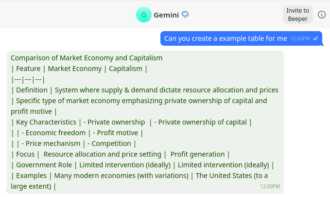

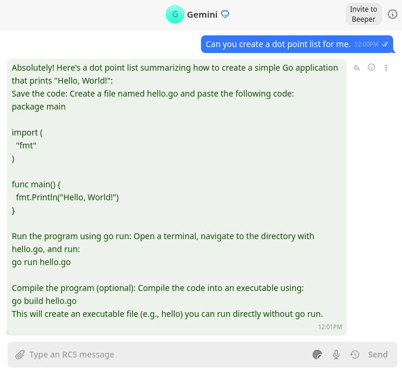

Although it looks like android might not be that well setup either:

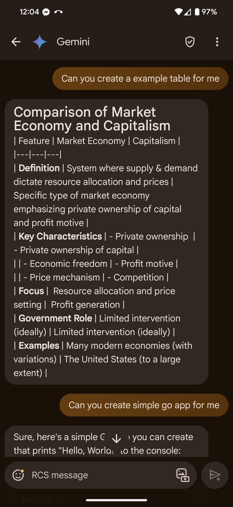

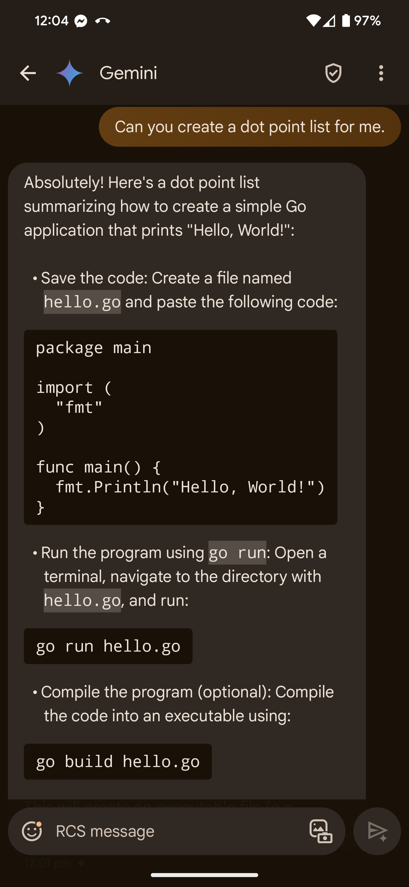

Given the client knows the protocol, it should be able to switch presentation based on source. However, given that 
Gemini is going over a different channel. I'm not sure if it would know how to distinguish it.

# Bug: Mixed text & multimedia messages don't send properly on discord

I wasn't able to replicate some of these problems, however one remaining one is that when you send a message with a 
multimedia component to a discord server it drops the `@` annotation / reference of the user:

[simplescreenrecorder-2024-05-31_12.14.35.mp4](simplescreenrecorder-2024-05-31_12.14.35.mp4)

Previously it would lose the message entirely. In discord that seems to be fixed.

# Bug & Gripe: Complete list of users missing

In a lot of protocols and the like you miss the complete list of users in a server, such as in discord. Meaning you get
a lot of these:

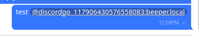

And then later you get a message that "they have joined the chat" when they haven't. Which is misleading, regardless if
it's understandable why that would happen.

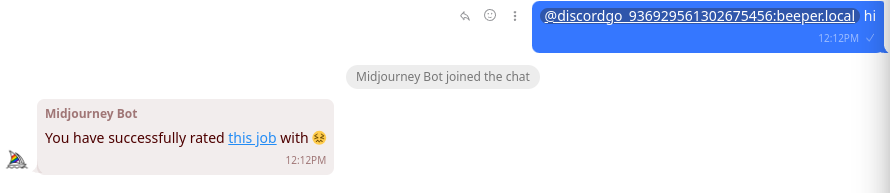

However, in the list of channel's preview it's clear that it does in-fact know the name of the intended user. 

# UX Gripe: Threads

I like how it treats threads to some degree, however they can be hard to follow, or hard to ensure that I stay in the thread
when replying. There needs to be more UX focus on this. Currently, threads are shown in beeper as a series of "replies" 
which is appropriate and cool. However, it has a couple consequences
1. How do I reply with and without creating a thread I need the ability to do both, with confidence I know what is happening
2. If I want to see the full thread and nothing else, as some can go on for days, and a different volume to the rest of 
the chat, how can I do so? - Ideally this would be threshold based IMHO.
3. How do I change my thread participation status to anything anytime or see a list of current threads? Both slack and 
discord have different thread implementations, so this is more of a discord problem. 

# UX Gripe: Grouping of protocols / servers

The list of connected services I have is __long__ and I need to scroll a lot. Discord has solved this by allowing you to
group servers in named categories very similar to that of iOS and Android. It's also not clear that you can scroll until
you use your mouse wheel (on the desktop).

# Feature suggestion: Snoozing messages & bookmarks & drafts & notes

Bookmarks are great, however they don't really prompt you to do anything. You can just create a bookmark. Given the way 
the feature works, you can only have a certain number of bookmarks at once. -- As there is no indicator or snoozing 
feature on bookmarks. I tend to forget they exist. This is a problem as the feature tends to fade into the background.
Bookmarks with a snooze feature, or some such could be one of the major selling points. Often you don't have enough time
to process a message at a particular point in time the ability to snooze it is great. -- I would argue that you should 
be able to snooze your drafts too, or/and leave notes which can be used as a draft.

However, as bookmarks currently stand they are kind of forgettable but could be a major feature with a little bit more 
UX consideration. What ever direction they are taking. So from here this is a single feature suggestion or multiple. 

# Gripe: Send later and multimedia content

You can send-later a message, but you can't send later multimedia content. -- I find myself wanting to do this about 50%
of the time. Often because I don't want to create more activity (and get distracted) by sharing a video or something 
when I'm busy. Think, snoozing to saturday / sunday, to lunchtime or 6pm.

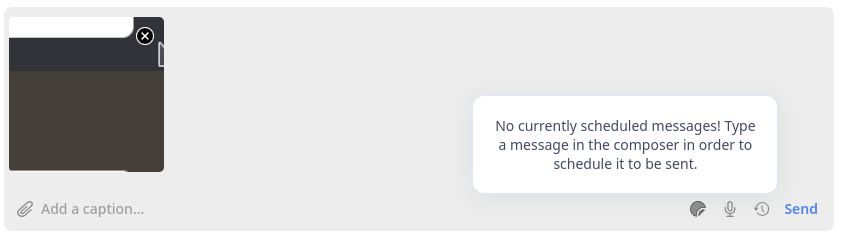

It also doesn't expressly /say/ that it can't do multimedia. It just ignores the picture at all.

# Bug: Send later has a weird delay 

Send later has a weird delay, where you can continue editing the message too. I don't think this is particularly good UX.

[simplescreenrecorder-2024-05-31_12.55.33.mp4](simplescreenrecorder-2024-05-31_12.55.33.mp4)

# Feature suggestion: Send later and a list of things pending send

When I use send later I use it a lot, including a lot in a single chat instance. You do get an indication:

But that indication is only for the chat you're in. Without there being more on that I am not even sure if I'm overriding
the previous snoozed message.

I am not sure how I can:
1. Delete a single snoozed message
2. Change the time of a snoozed message
3. Convert a snoozed message back to a draft / edit the message
4. Get a complete list of snoozed messages

A global list of snoozed messages, perhaps as a "chat pane component" in the "low priority" section might work. -- Or
just another modal.

# Feature suggestion: Debouncing messages

A grip of most chat platforms I have is that some people type only just a couple words per message then press enter 
before the next one. I would like the ability to configure a temporary mute for any private message for a set time after
each message until I check the message.

# Feature suggestion: Grouping of contacts in to "people"

Sometimes I use multiple chat platforms to talk to people. With the favourite feature you can only really favourite 
channels, private message groups, or accounts. I would like the ability to group a person, so that when I click on them,
I get something similar to what I get when I search for a person. IMHO This should be managed inside beeper and not 
synchronized with contacts or what not but related. Perhaps allowing imports, and exports but in an explicit way.

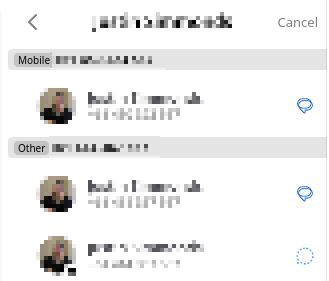

# Feature request: Creation of group chat

This is probably more of a bridge concern, or a protocol limitation. But you can only create group chats, and "channels"
for Matrix and Google Messages. (Not sure about meta services)

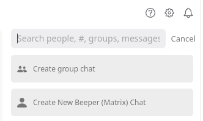

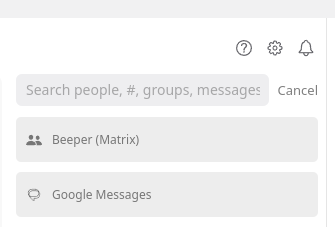

Group chats is something I use a lot, so until I get better support, I am not sure if I can uninstall the apps. (Also 
for another reason later.)

This seems like a pretty big feature to be missing.

# Gripe: Local caching / scrolling issues on large chats

Backscrolling, search, jumping to a message, and opening a chat are slower than they need to be. I figure that this is
because of a lack of local caching / history storage. Least on the electron app. It seems to be protocol specific too.
Here it is with slack:

[simplescreenrecorder-2024-05-31_13.11.00.mp4](simplescreenrecorder-2024-05-31_13.11.00.mp4)

# Feature Suggestion: Point in time navigation - ie go to a specific date in history

I would like the ability to specify a date/time to scroll to, rather than just having to scroll up. Perhaps this could
be done with some sort of in-chat-window search.

# Gripe: Preservation of history when channels disappear

Discord servers particularly are likely to rename / move / change permissions on channels which can cause them to move
and rename etc. I dislike my history disappearing so easily. Perhaps have a "Dead Channel" or something status / section
similar to "Low Priority" that these can congregate to.

# Bug: Discord metadata for servers not updating

When a discord server changes its icon, or name or anything else. This is not updating, and there is no clear way of 
telling beeper that it needs to update. Without removing and readding it. Which then would cause a loss of data, such as
chat history, bookmarks, snoozed messages, and the like.

# UX Complaint: Better presentation of "inbox"

The UX could be improved, the unread and 'all' is nice (however it really isn't all b/c there is an 'archive') 
Perhaps some configuration around that would be nice. Currently, there is a lot of wasted vertical space on the electron 
version of the application. Instead of being tabs, perhaps they could be categories.

Currently:

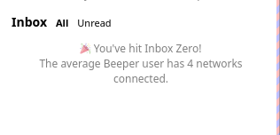

Proposed: (Needs work indicative.)

# Bug: File upload on linux requiring multiple clicks

For some reason on my Beeper when I click:

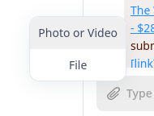

It requires multiple clicks to work. I think it's bad event propagation, it seems to be trying to trigger only when it
gets a mouse down followed by a mouse up event, and there is loss. Sometimes it triggers multiple times. There is also
a delay bringing up the native UI dialog.

# Packaging request: No official flatpak / apt repo

The app image is nice. Also being able to just put the executable in my ~/.local/bin is great. However I would like more
distro support. It isn't too hard to generate a .deb / .rpm with a go project via https://goreleaser.com/ and I have an
example of installing a `.desktop` file with that here: 
https://github.com/arran4/send-to-google-photos/blob/main/.goreleaser-linux.yaml#L26-L42

Flatpaks I'm less aware of how to do, but it makes more sense for a desktop app. Especially self-contained ones. 

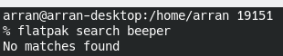

# UI gripe: Weird choice of iconography

Nothing major just some of the iconography / symbolism is a bit weird. Such as when you lose a bridge, you get an `(x)` 
which clearly indicates that it's disconnected, HOWEVER I read that as a "remove/delete" rather than a disconnected.

There are some alternatives such as a warning label like what slack does:

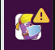

Or just ‼️

Or no service: 📵

But it should be 2, one of the above and a gear ⚙️ because it shows status and action. -- However the action could perhaps
be in a long press / right click menu instead.

# UX gripe: Edit messages only once & clearer limitations per protocol

Given different protocols have different capabilities, such as limits on length or messages, attachment sizes, how many 
times, or how long it is until you can no longer edit a message: Beeper should attempt to try communicate some of these
protocol limitations to you better if they can't be "abstracted" away.

# Feature suggestion & bug: Local network and device sync to prevent "floods"

I have multiple devices connected, phone, laptop, and desktop. My phone has both clients installed. (And the original 
without notification turned off.) IPv6 probably makes this harder however some sort of coordinated messaging, especially
if I have already read a chat on one platform there should be some local traffic or some such so that other systems /
clients don't produce notifications "late."

It's specially bad with the native android client, which I often get notifications when I move my phone minutes later 
because of google's power saving probably the Doze mode amongst other things: 
https://developer.android.com/training/monitoring-device-state/doze-standby 
I would really expect that the android would get synchronized before sending the notifications out.

# UX gripe: Beeper android vs desktop

I find the mobile apps, especially the native Android mobile app, significantly different in the way it handles inbox 
and other messages to the point of not wanting to use it for group chats and other things. -- Although I acknowledge 
like the whole app that it's a work in progress.

# Feature request: Favourites vs other listings ie "people"

I would like a more traditional list of contacts, or set of lists of users (which would be more useful, ie where I can 
tag / label them and favorite is just one of many labels.) So I get a "friend list." Right now search is mostly usable
for me. 

I would also like the beeper managed "contact" thing from earlier, especially given that some people change their names
often on platforms like Discord.

# Feature suggestion: Webclient especially for having Matrix discussion groups

I would love to use matrix group chats more, however I feel they could really only happen if Beeper made it easier for 
me to involve people that wouldn't ordinarily install beeper, or a matrix client. Such as via a webportal. Given that
Beeper is already a electron app it doesn't seem like it would be too difficult to develop a simplified version of
Beeper that works in the browser on a temporary basis that's similar to https://matrix.to/ perhaps with a guest mode and
an authenticated mode. Ie think I'm travelling have access to a chromebook temporarily and my phone and want to chat,
with a real keyboard. -- Or I have a group chat going and need someone to drop in temporarily so, I send them a link
to quickly drop in.

# Feature request: Audio messages transcripts

Given ANN systems like WhisperAI are available now there is no need for voice recordings (and perhaps even videos) not 
to have client generated transcripts. While systems without any AI optimized chip (ie GPU) would be slow, they can do it
upon request, while my desktop with a modern Nvidia machine I think should be able to do it automatically given that 
there is enough video ram. (Ie I'm not playing a game.) This is also an accessibility feature.

I do use audio transcripts a lot and would use them more if they had a means of getting a transcript.

The only service I know to do transcriptions like that is Slack. Having a way of shuffling around the data so only one
machine needs to do the work might be worth it too. Could also be used for bookmarks and message notes.

# Feature suggestion: Send later suggested / configurable quick times

Being able to type a snooze date/time in relative or absolute times is nice. I also often know what times I would usually
want. Platforms like Google Inbox, allowed you to specify 3. This got brought into Gmail in general:

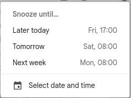

It's no longer as configurable. How I suggest it's done is having a "recently used" set, which gives you the option 
inside the popup to "star" / "keep" any one which is either:
a) Sufficiently in the future
b) Relative

Which can be quickly selected next time. While still relevant.

In my [Which Browser?](https://arranubels.substack.com/p/which-browser) app. I attempted to do this like so -- However
it's very primitive and will be fleshing it out later:

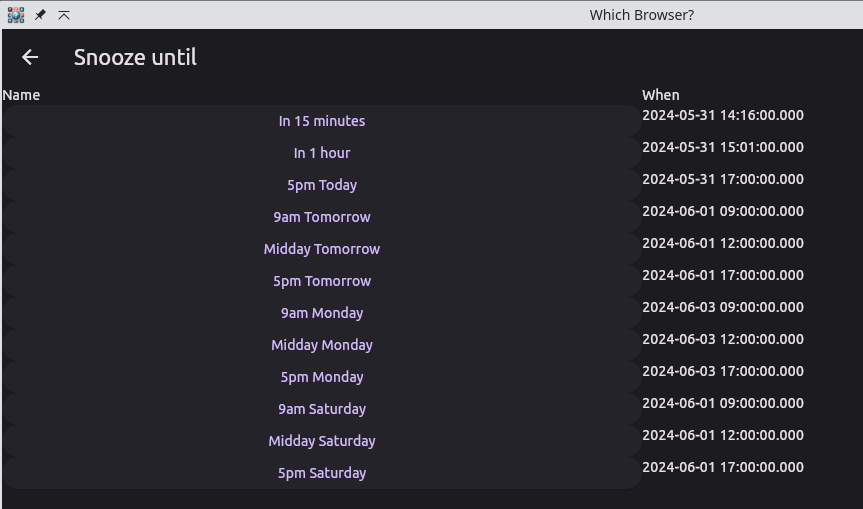

# Feature request: Simultaneous chats, Tabs, multiple windows, pop out chat, concurrent conversations

Some means of being able to see two chats at once, or being able to "retain" your position in a chat without a "context"
refresh (such as finding it again and opening it.) This is obviously on desktop only, however even on mobile, the OS
does support an "activity" which you press back to go back to your prior activity, which is pretty similar in the intent.

I imagine the easiest way would be to allow for tabs. However, I would like floating windows for specific chats for 
reasons. Especially where I don't have the other cruft of the Beeper UI. However, given that it's a electron app I don't
know how viable this is.

# Gripe: Account and history recovery

I would like some way of going back to the past where history isn't lost, even if I lose my connection / bridge. This 
would be especially helpful with SMS and the like so I don't need to use tools like:
https://play.google.com/store/apps/details?id=com.riteshsahu.SMSBackupRestore&hl=en_AU

In-fact it was a primary reason for setting up SMSs to work over beeper in the first place. However, it doesn't feel that
true right now given the way discord and slack channels disappear without a trace.

# Gripe: Themes

Needs more work to feel like a first party feature. Or even simply providing a list of themes from:
https://github.com/beeper/themes
Right now it feels very daunting. I did try use it once to increase the default font size. 

I would like to use a Gist or a Github URL as a theme rather than just use the text box.

# UI Gripe: Hide display button

The hide display button needs a bit of "separation" from the "groups"

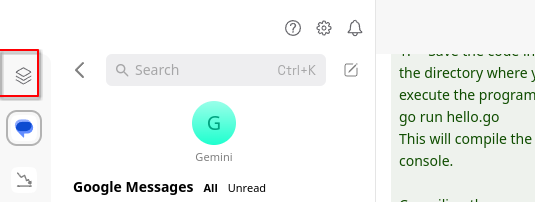

I keep on clicking it instead of "Inbox."

--

Later additions

# Bug: Hogs media player on Plasma after playing media

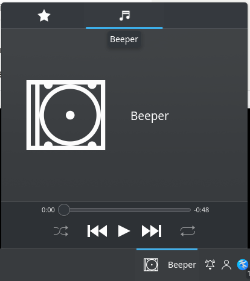

More of an electron issue. But once you use beeper to listen to something, it doesn't return control to the media player
meaning you're keyboard media keys do nothing.

--

# Final thoughts

I am looking forwards to the future of Beeper. I would love to see these points addressed in some form. I have not used
the Android apps as much as I would like as I am predominately a desktop user. (I can't get away from my keyboard.)

I do think that the Matrix protocol it pretty cool but it might not be appropriate for device communication as it is a
standard and is subject to design by committee.

# Notes

I might add to this rather than creating new posts.

# Contact

You can contact me on matrix using the following:
* @arran4:beeper.com

Seldom used: (I plan to host my own as that's where all the benefit is)
* @arran4444:matrix.org
* @arranfour:matrix.org

Really Seldom used:
* @arran4:gnulinux.club
